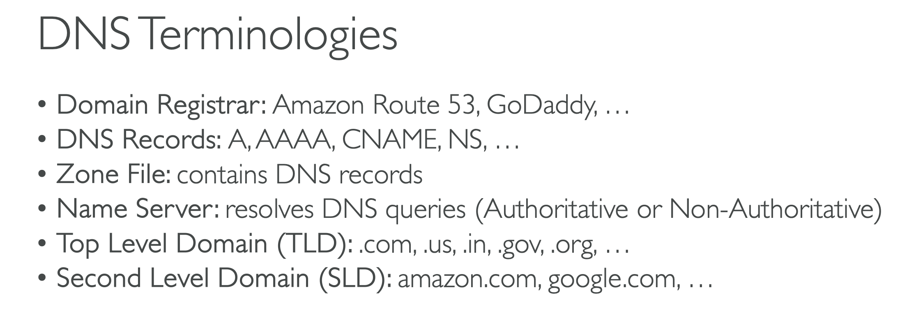

# WHAT IS DNS?

## Domain Name System, which translates the human friendly hostnames into machine IP adresses.

## www.google.com => 172.217.18.316.

## Dns is the backbone of the internet.

## DNS uses hierarchical naming structure

### .com

### example.com

### www.example.com

### api.example.com

# DNS TERMINOLOGIES

## Domain Registrar: Amazon, Route 53 , Godaddy

## DNS Records: A, AAAA, CNAME, NS

## Zone File: contains DNS Records

## Name Server: resolves DNS queries(Authoritative or Non authoritative)

## Top Level Domain(TLD): .com,,us,.in,.gov,.org

## Second Level Domain(SLD):amazon.com,google.com

# HOW DNS WORKS

# For eaxmple we have a web server, and an ip , a public ip(9.10.11.12), could be an EC2 instance for example

## The web browser is going to access example.com

## Its going to ask its local DNS server, hey do you know what example.com is

## Local DNS server, is usually assigned and managed by your company or assigned by your ISP dynamically

## And if the local DNS server has never seen this query before, its first going to ask its ROOT DNS server managed by the ICANN organisation

## Its going to say to ICANN , do you know what is example.com, the root DNS server is going to be like, i have never seen it but i know .com

## .com is NS , so its a NS Record Name Server which has IP => 1.2.3.4

## Now i am going to ask the TOP LEVEL DOMAIN managed by the IANA, example.com is going to be asked to this DNS server

## There is a server called example.com that i know about, which is at =>5.6.7.8 , that is a public IP
