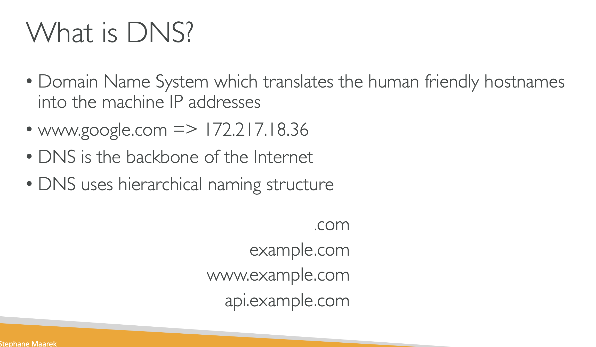

# WHAT IS DNS?

## Domain Name System, which translates the human friendly hostnames into machine IP adresses.

## www.google.com => 172.217.18.316.

## Dns is the backbone of the internet.

## DNS uses hierarchical naming structure

### .com

### example.com

### www.example.com

### api.example.com

# DNS TERMINOLOGIES

## Domain Registrar: Amazon, Route 53 , Godaddy

## DNS Records: A, AAAA, CNAME, NS

## Zone File: contains DNS Records

## Name Server: resolves DNS queries(Authoritative or Non authoritative)

## Top Level Domain(TLD): .com,,us,.in,.gov,.org
