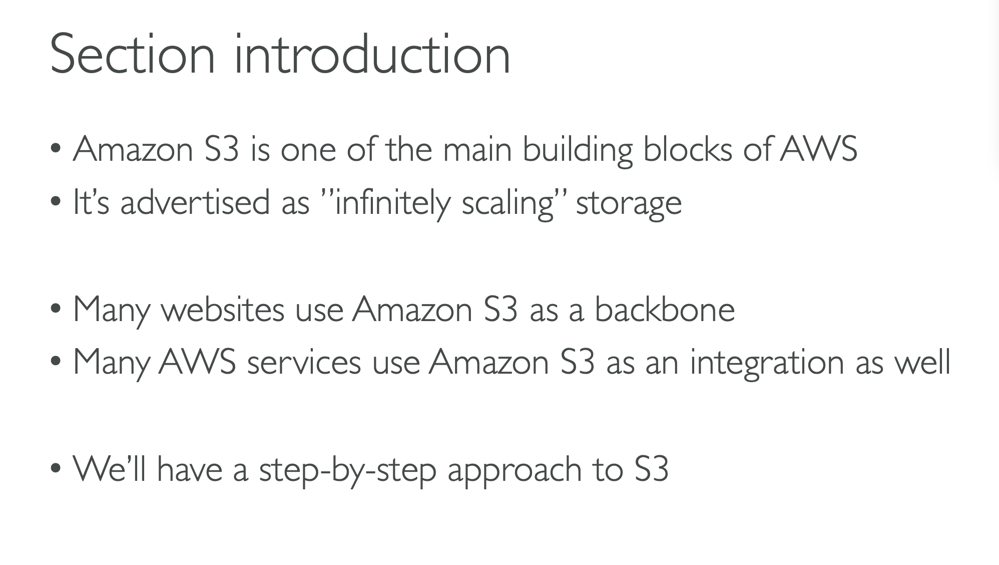
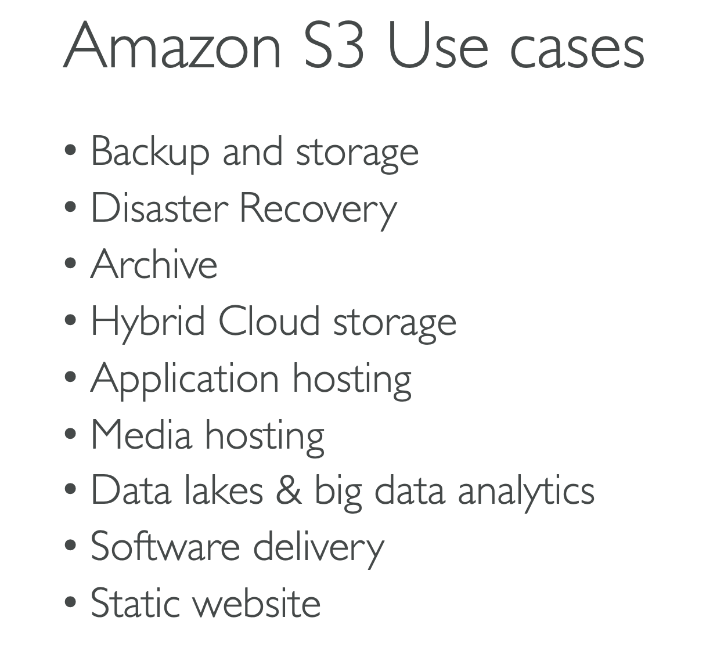
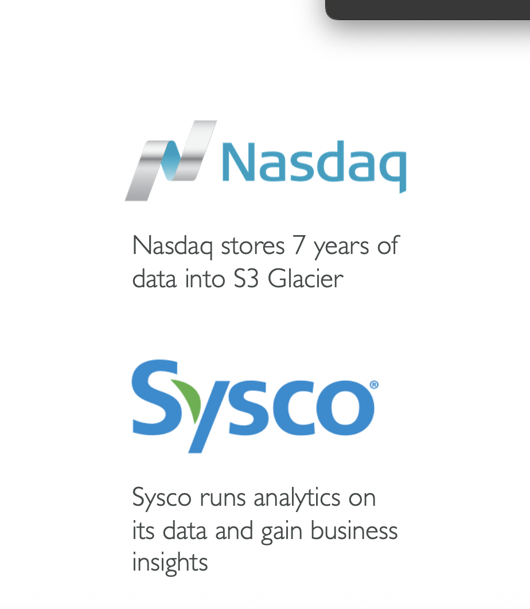

# AMAZON S3: INTRODUCTION

## AMAZON S3 is one of the main building blocks of aws.

## Its advertised as "infinitely scalling" storage.

## Many websites use Amazon s3 as backbone.

## Many AWS services also use Amazon S3 as an integration as well

## Amazon S3 use cases

### Backup and Storage

### Disaster Recovery

### Archive

### Hybrid cloud storage

### Apllication Hosting

### Media Hosting

### Data lakes and big analytics

### Software Delivery

### Static website

## EXAMPLE:

### Nasdaq stores 7 years of data into s3 glacier

### Sysco runs analytics on its data and gaind businesss

### Amazon S3 allows people to store objects(files) in "buckets"(directories)

### Buckets must have A GLOBALLY UNIQUE NAME (ACROSS ALL REGIONS ALL ACCOUNTS )

### Buckets are defined at the region level

### S3 looks like a global service but the buckets are created in a region

## Naming Convention

### No Uppercase, No Underscore

### 3-63 charachters long

### Not an IP

### Must start with lowercase letter or number

### Must not start with prefix xn--

### Must not end with suffix -s3alias

## Amazon S3 Objects

### Objects(files) have a key

### The KEY is the FULL Path:

### s3://my-bucket/my_file.text

#### KEY = my_file.txt

### BUT IN CASE YOU WANT TO NEST IT IN FOLDERS

### The key is composed of PREFIX + // OBJECT NAME //

### s3://my-bucket/my_folderI/another_folder/my_file.txt

### 
