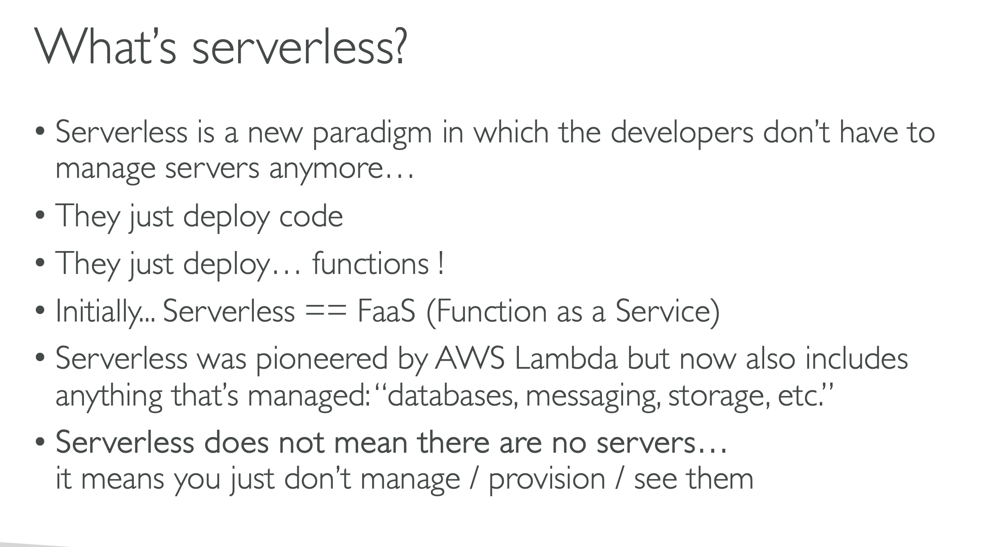
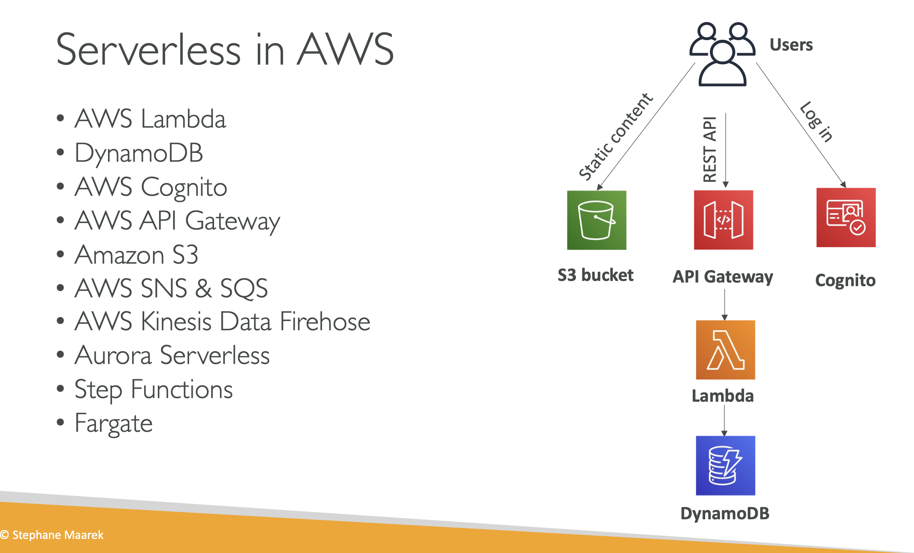

# SERVERLESS INTRODUCTION

# What's serverless

## Serverless is a new paradigm in which developers dont have to manage servers anymore

## They just deploy

## They just deploy functions

## Initially Serverless === Function as a service(FAAS)

## Serverless was pioneeered by AWS Lambda but now also includes anything that's managed: databases, messaging , storage etc.

## Serverless dosent mean there are no servers

## it means you just dont manage/provision / see them

### We have our users they will static content from our S3 bucket, or cloudfront + S3

### Then we would login with cognito , this is where our users would have there identity stored and they would invoke the REST API through the API GATEWAY, API GATEAWAY would invoke lambda functions and lambda functions will store and retrieve data from Dynamo DB

# Serverless in AWS

## AWS LAMBDA

## DYNAMO DB

## AWS COGNITO

## AWS API GATEAWAY

## AMAZON S3

## AWS SNS AND SQS

### We did not manage any services using SNS AND SQS it was scalling on its own, and it was scalling on its own, so that fits the serverless use case

## AWS KINESIS DATA FIREHOSE

### It scales based on the thoughtput you have, you just pay for what you use and dont provision servers

## AURORA SERVERLESS

### Aurora Database scales on demand without you managing servers

## STEPFUNCTIONS

## FARGATE

### Fargate was a serverless function of ECS

