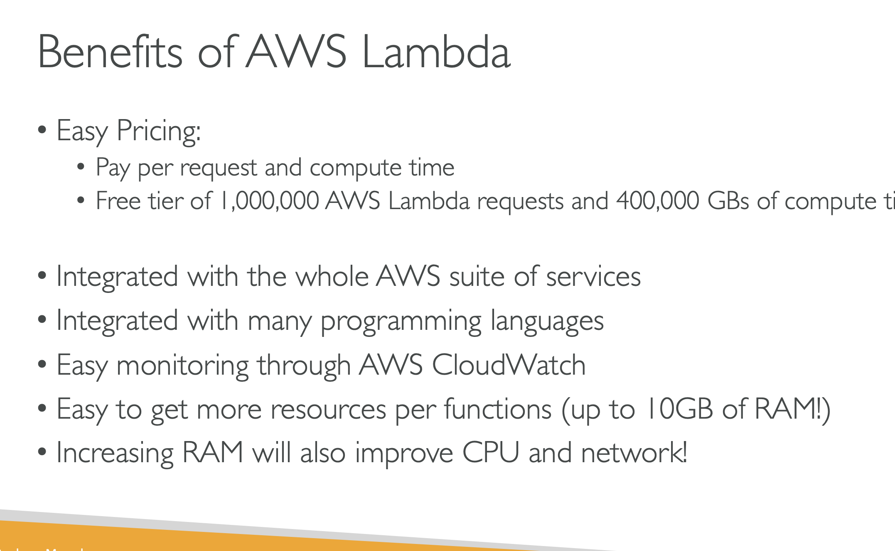
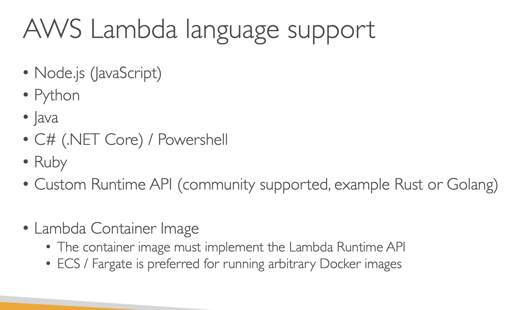
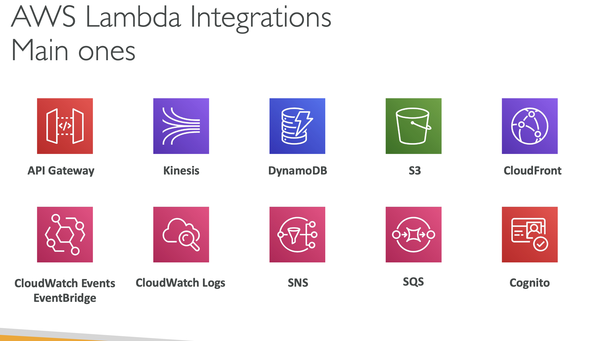
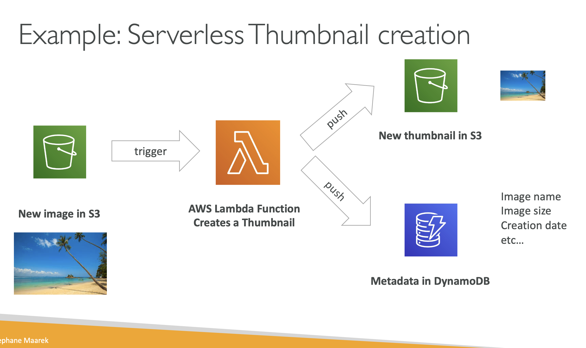
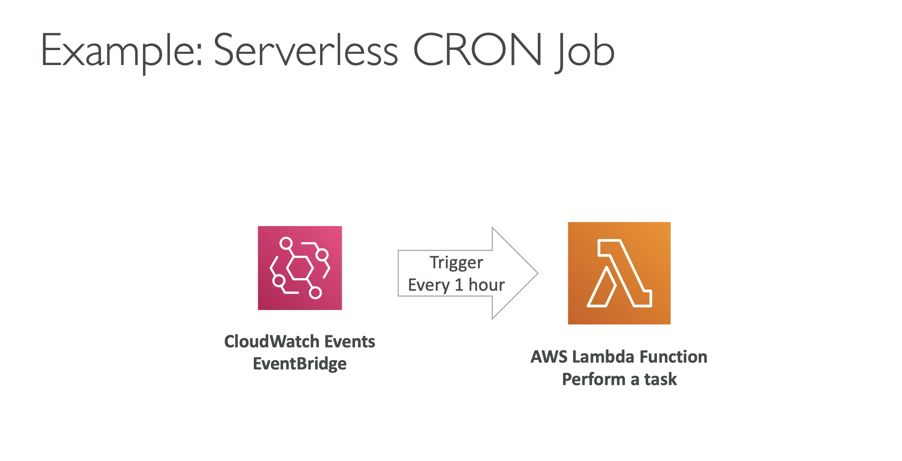
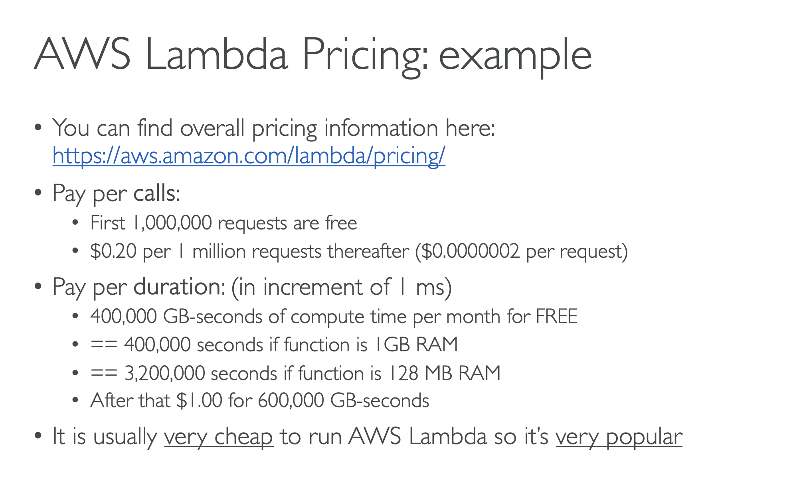

# LAMBDA OVERVIEW

# WHY AWS LAMBDA

## Lets take an example we have amazon ec2 , as we know they are virtual servers in the cloud and we have to provision them, so we are limited by the RAM and CPU, CONTINOUSLY RUNNING

## Scalling means intervention to ADD/REMOVE servers

## virtual FUNCTIONS - no servers to manage!

## limited by time - short executions

## Run - on demand

## Scalling is automated

# BENEFITS OF AWS LAMBDA

## Easy Pricing

### Pay per request and compute time

### Free teir of 1,000,000 AWS Lambda requests and 400,000 GB's of compute time

## Integrated with whole AWS suite of services

## Integrated with many programming languages

## Easy monitoring through AWS Cloudwatch

## Easy to get more resources per functions(up to 10GB of RAM)

## Increasing RAM will also improve CPU and network

# AWS LAMBDA LANGUAGE SUPPORT

## Node.js(JavaScript)

## Python

## Java

## C# (.NET Core)/ Powershell

## Ruby

## Custom Runtime API(community supported , example RUST AND GOLANG)

## lambda Container Image

### The container image must implement the Lambda Runtime API

### ECS/Fargate is preferred for running arbitary Docker images

# AWS LAMBDA INTEGRATIONS

## API GATEAWAY

### Create a REST API and they will invoke our lambda functions

## KINESIS

### will be using lambdas to do some data transformations on the fly

## DYNAMODB

### will be used to create some triggers, so whenever something happens in our database a lambda function will be triggered

## S3

### a lambda function will be triggered anytime a file is created in S3

## CLOUDFRONT

### cloudfront is lambda at edge

## CLOUDWATCH EVENTS EVENTBRIDGE

### This is whenever things happen in our infrastructure on AWS and we want to be able to react to things

### For example, say we have a codepipeline state changes and we want to do some automation based on it

## CLOUDWATCH LOGS

### cloudwatch logs to stream these logs whenever you want

## SNS

### SNS to react to notifications in your SNS topics

## SQS

### SQS to process messages from your SQS Queues

## COGNITO

### to react to whenever a user logs into your database

# EXAMPLE: SERVERLESS THUMBNAIL CREATION

# lETS SAY WE HAVE AN S3 BUCKET

## And we want to create thumbnails on a flight, so there will be an event , which is that the new image will be uploaded on amazon s3

## this will trigger through an S3 event notification, a lambda function

## That Lambda function, we"ll have code to generate a thumbnail

## That thumbnail may be pushed or uploaded into another S3 bucket or the same S3 Bucket, which will be a smaller version of that image And also , our lambda function may want to insert some data into Dynamo DB around some METADATA for the image

## for example: Image name, Image size , creation date etc

# EXAMPLE: SERVERLESS CRON JOB

## create a Cloudwatch Events EventBridge that will be triggered every one hour

## every one hour it will be triggered and integrated with a lambda function that will perform your task

# AWS Lambda Pricing

