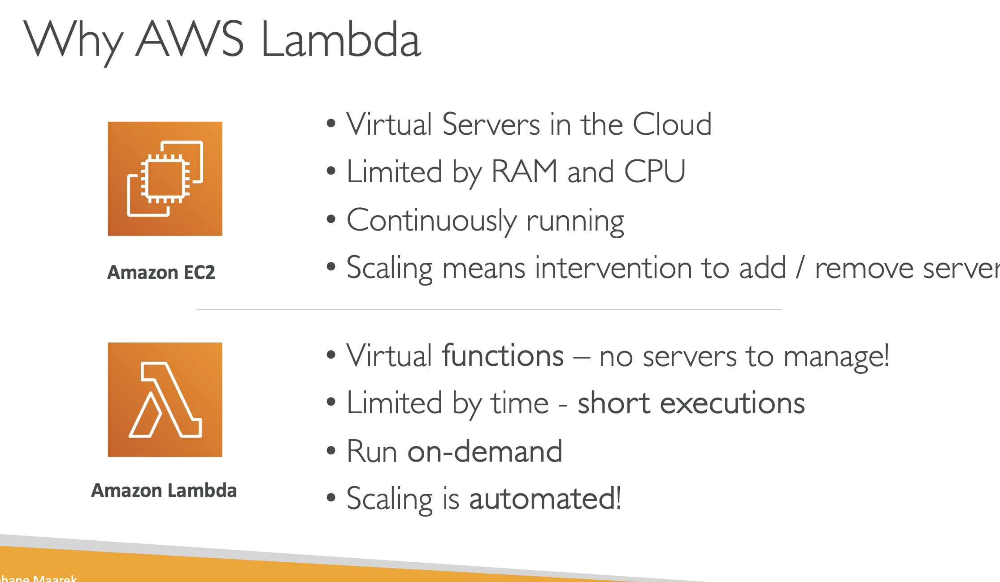

# LAMBDA OVERVIEW

# WHY AWS LAMBDA

## Lets take an example we have amazon ec2 , as we know they are virtual servers in the cloud and we have to provision them, so we are limited by the RAM and CPU, CONTINOUSLY RUNNING

## Scalling means intervention to ADD/REMOVE servers

## virtual FUNCTIONS - no servers to manage!

## limited by time - short executions

## Run - on demand

## Scalling is automated

# BENEFITS OF AWS LAMBDA

## Easy Pricing

### Pay per request and compute time

### Free teir of 1,000,000 AWS Lambda requests and 400,000 GB's of compute time

## Integrated with whole AWS suite of services

## Integrated with many programming languages

## Easy monitoring through AWS Cloudwatch

## Easy to get more resources per functions(up to 10GB of RAM)

## Increasing RAM will also improve CPU and network

# AWS LAMBDA LANGUAGE SUPPORT

## Integrated with whole AWS suite of services

## Integrated with many programming languages

## Easy monitoring through AWS Cloudwatch

## Easy to get more resources per functions(up to 10GB of RAM)

## Increasing RAM will also improve CPU and network

# AWS LAMBDA INTEGRATIONS

## Integrated with whole AWS suite of services

## Integrated with many programming languages

## Easy monitoring through AWS Cloudwatch

## Easy to get more resources per functions(up to 10GB of RAM)

## Increasing RAM will also improve CPU and network

# EXAMPLE1:

## Integrated with whole AWS suite of services

## Integrated with many programming languages

## Easy monitoring through AWS Cloudwatch

## Easy to get more resources per functions(up to 10GB of RAM)

## Increasing RAM will also improve CPU and network

# EXAMPLE2:

## Integrated with whole AWS suite of services

## Integrated with many programming languages

## Easy monitoring through AWS Cloudwatch

## Easy to get more resources per functions(up to 10GB of RAM)

## Increasing RAM will also improve CPU and network

# EXAMPLE3:

## Integrated with whole AWS suite of services

## Integrated with many programming languages

## Easy monitoring through AWS Cloudwatch

## Easy to get more resources per functions(up to 10GB of RAM)

## Increasing RAM will also improve CPU and network
