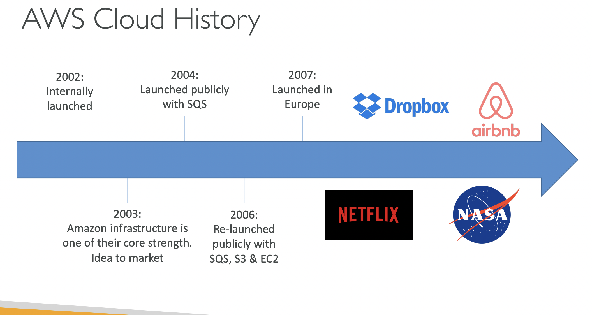
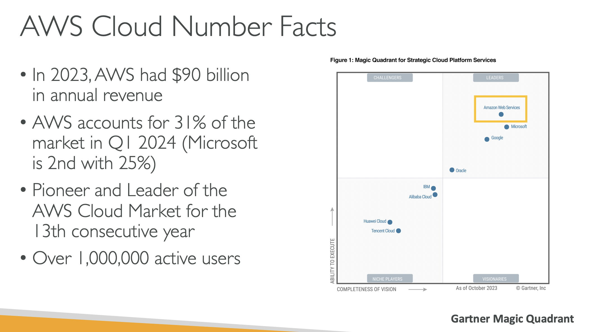
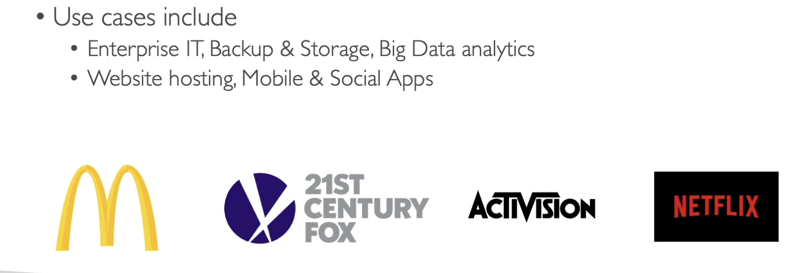
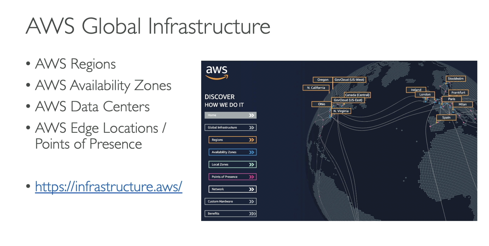
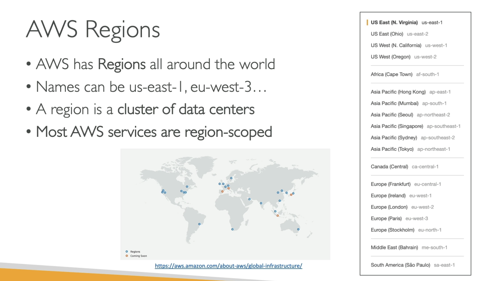
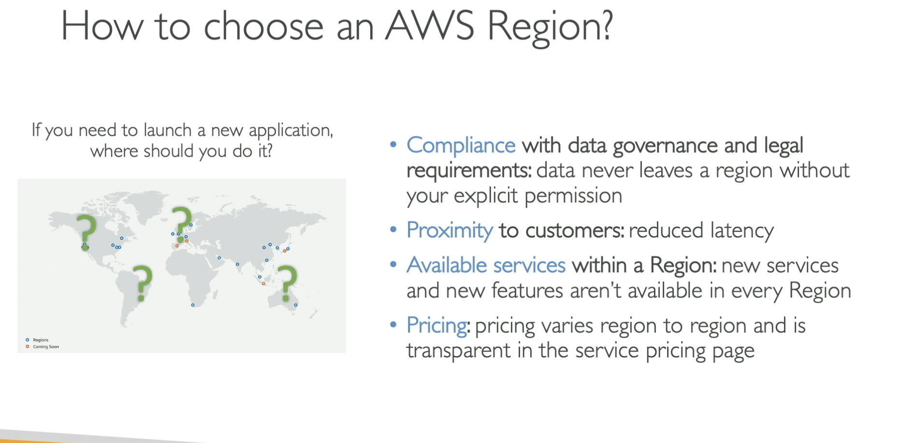
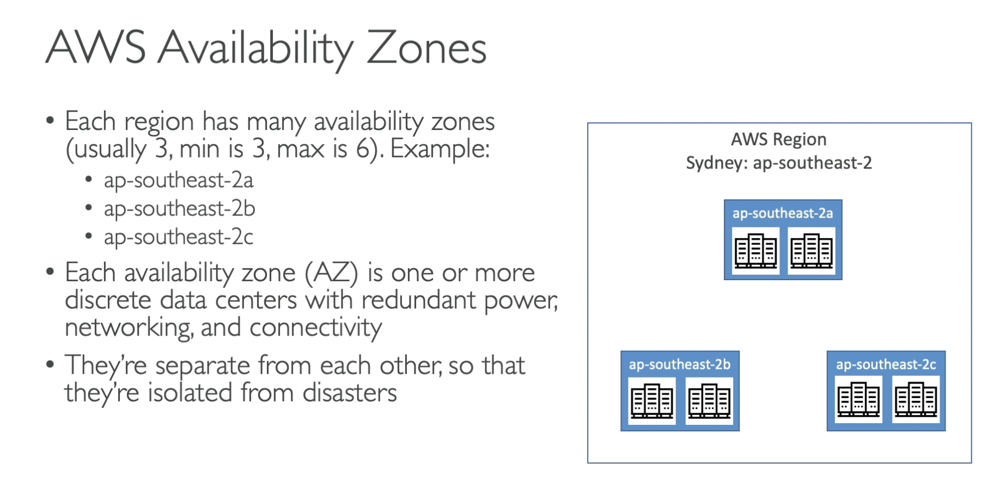
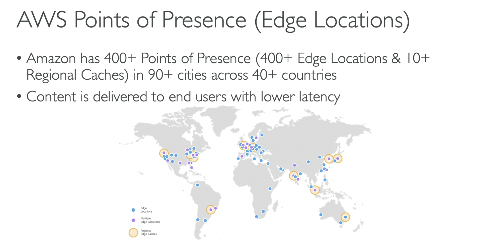
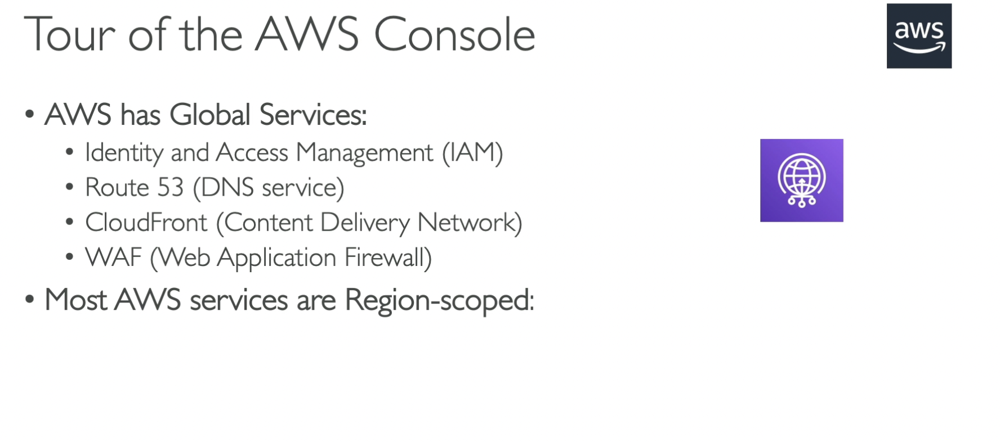
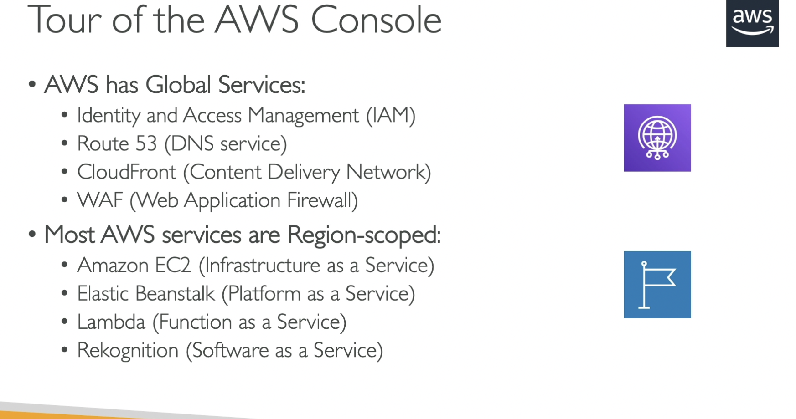

# AWS CLOUD HISTORY

## It was launched internally at amazon in 2002, beacuse they realized that their IT department could be externalized.

## Amazon Infrastructure was one of their core strength so they realized we could do IT for other people.

## Launched publicly with SQS in 2004.

## In 2006 they relaunched publicly with SQS , S3 and EC2.

## In 2007 they launched IN Europe.

## Today we have so many applications like Dropbox, Airbnb , Netflix and Nasa.

# AWS CLOUD NUMBER FACTS

# AWS CLOUD USE CASES

## AWS enables you to build sophisticated, scalable applications.

## Applicable to diverse set of industries.

## Usecases include Enterprise IT, Backup and storage , Big data analytics

## Website hosting mobile and social apps

# AWS GLOBAL INFRASTRUCTURE

## AWS Regions

## AWS availability zones

## AWS Data centers

## AWS Edge locations/Points of reference

# AWS REGIONS

## AWS has regions all around the world.

## Names can be us-east-1 , eu-west 3.

## A region is a clustor of Data Centers.

## Most aws services are region scoped.

# How to choose an AWS region?

## If you need to launch an application where should you do it?

## It depends on few factors listed below

### COMPLIANCE with data governance and legal requirements: data never leaves a region without your explicit permisiion.

### PROXIMITY to customers: reduced latency.

### AVAILABLE SERVICES within a region: new services and new features arent available in every region.

### AVAILABLE SERVICES within a region: new services and new features arent available in every region.

# AWS AVAILIBILTY ZONES

## Each region has many availibility zones(usually 3 , min is 3 , max is 6)

### For example: AWS REGION: SYDNEY

### ap-southeast-2a

### ap-southeast-2b

### ap-southeast-2c

## Each availibility zone(AZ) is one or more descrete data centers with redundant power , networking and connectivity

## That means that ap-southeast-2, we could have two data centers

## it could be any amount of data centers 2 in ap-southeast-2a

## They are seperate from each other so they are isolated from disasters

# AWS POINTS OF PRESENCE(EDGE LOCATIONS)

## Amazon has 400+ Points of Presence(400 + Edge locations + 10+ regional cahes) in 90+ cities across 40+ countries.

## Content is delivered to end users with low latency

# Tour Of AWS Console

## AWS has Global Services

### Identity and Acess Management(IAM)

### Route 53(DNS Service)

### CloudeFront(Content Delivery Service)

### WAF(Web Aplication Firewall)

## Most AWS services are region scoped

## Most AWS services are Region scoped

### Amazon EC2(Infrastructure as a service)

### Elastic Beanstalk (Platform as a service)

### Lambda(Function as a service)

### Recognition(Software as a service)

