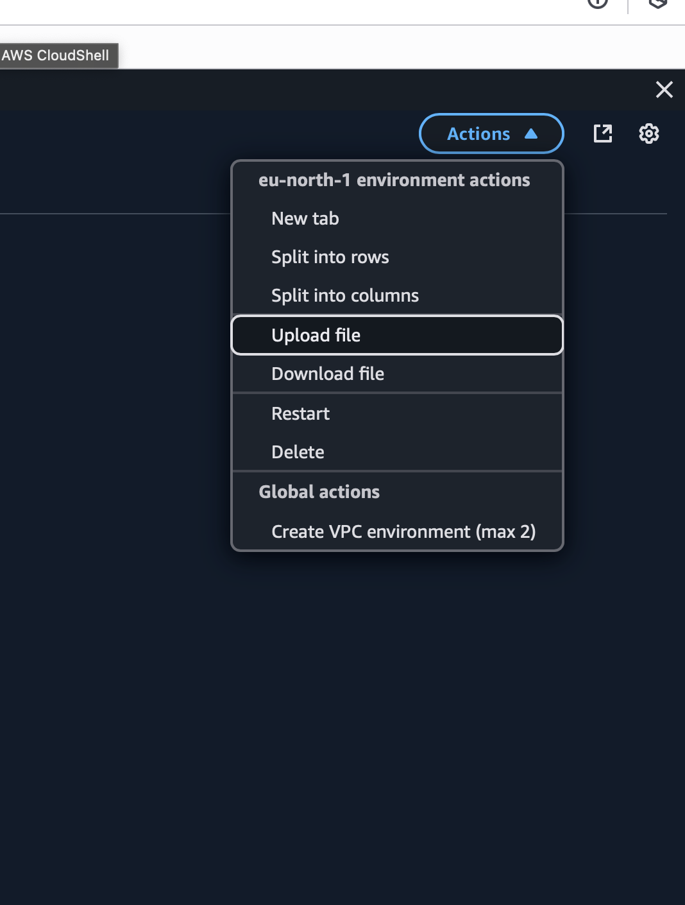

# AWS CLOUD SHELL

# This symbol blue is the aws cloudshell symbol

# If you do not get the symbol that means aws cloudshell is not available in these regions you can use the console to change the regions:

## write the aws command we see this

### cloudhshell is a terminal in the aws cloud that is free to use

## for example if you type echo "test" > demo.txt

## all these files are going to stay in the cloudshell

## If you restart the cloudhsell then this file would stick

# you can design the cloudshell

# you can also configure the cloudshell

# you have the possibility to upload and download files in the cloudshell

## use the pwd command to check the path of the file

## Actions

## if you click on newtab you will see two terminals in the cloudshell

