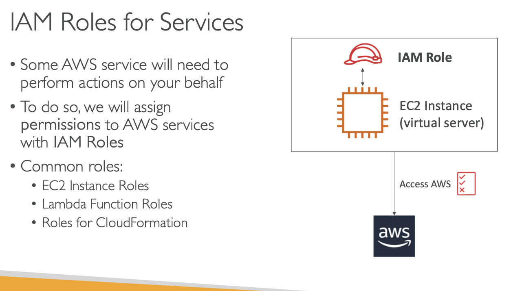

# IAM ROLES FOR AWS SERVICES

## Some AWS service will need to perform actions on your behalf

## To do so , we will assign permissions to AWS services with IAM Roles

### we will create an EC2 Instance , which is a virtual server

### EC2 instance may want to perform same action on AWS and to do so , we need to give permission to our EC2 Instance.

## we have to create an IAM ROLE

## IAM ROLE + EC2 INSTANCE => ONE ENTITY

## ACCESS AWS

