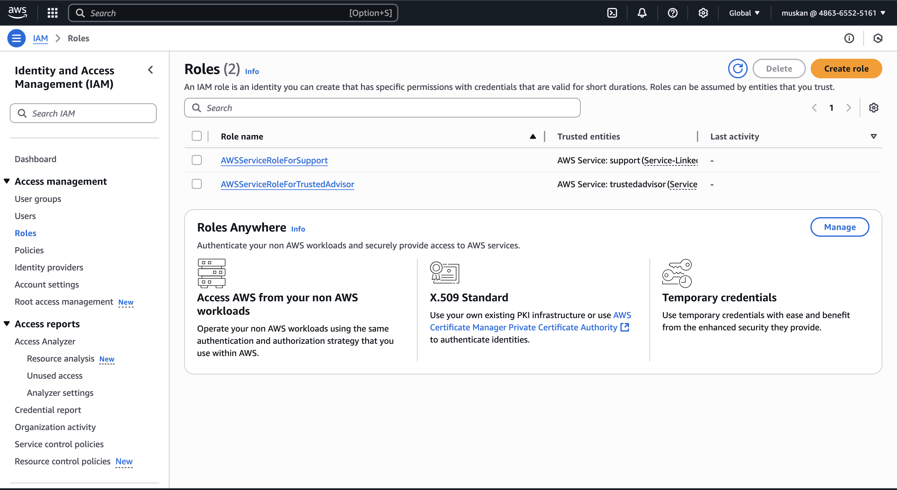
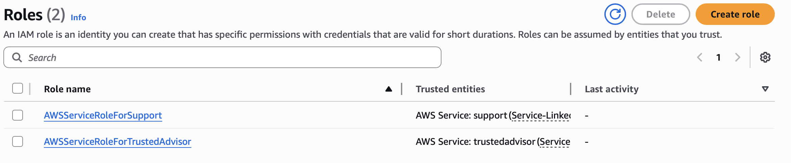
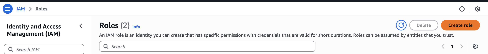
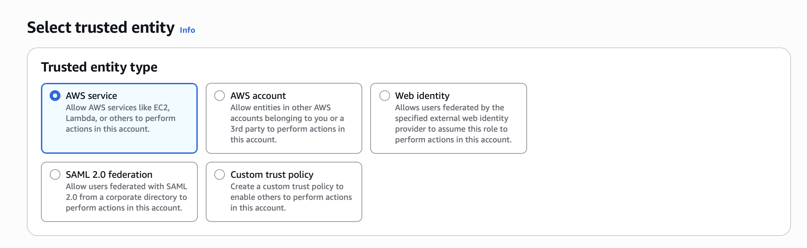
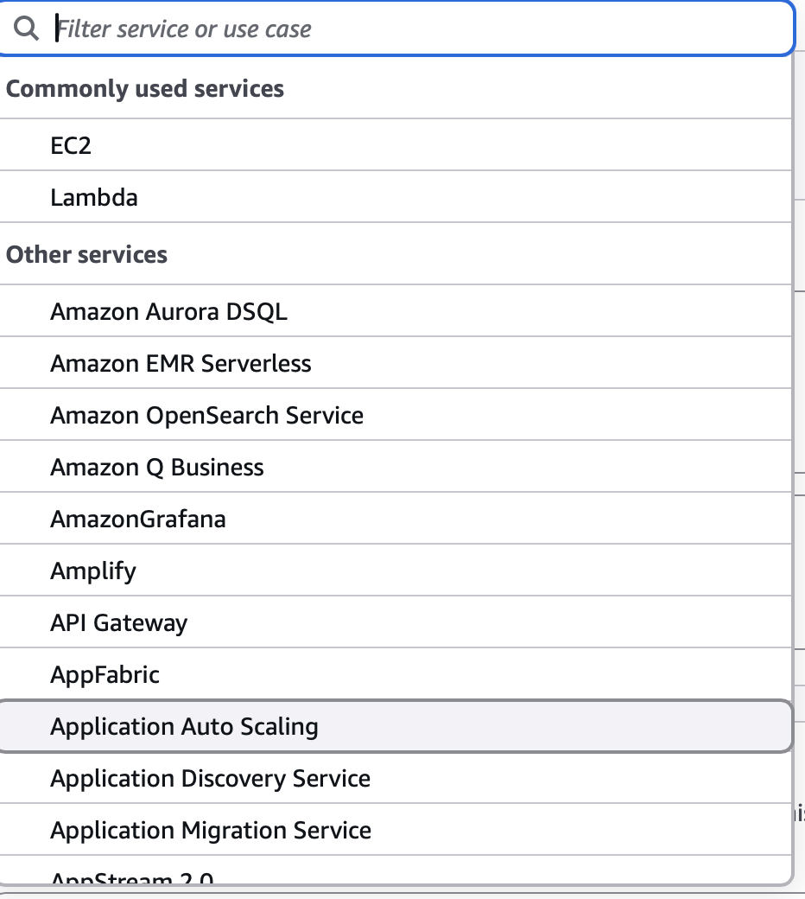
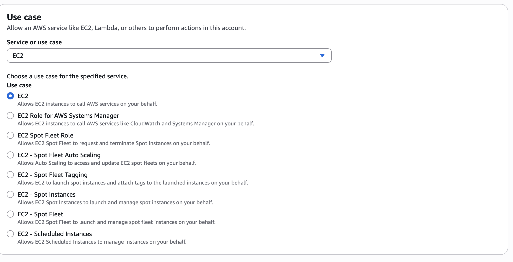
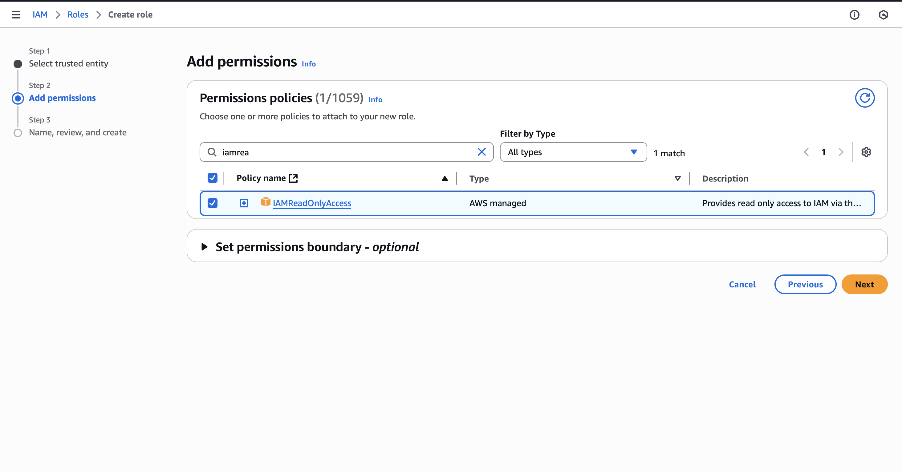
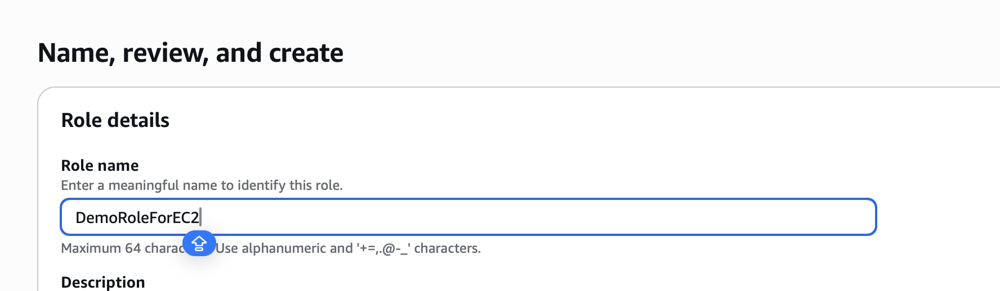
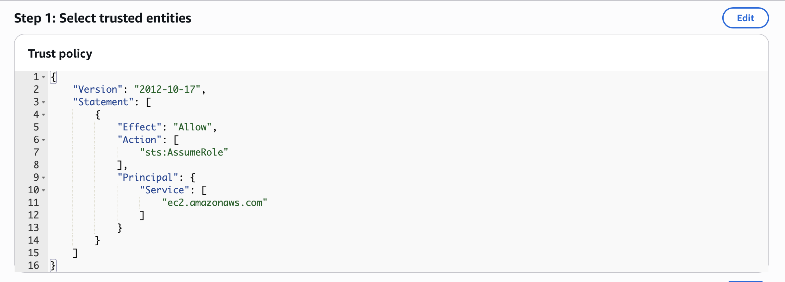
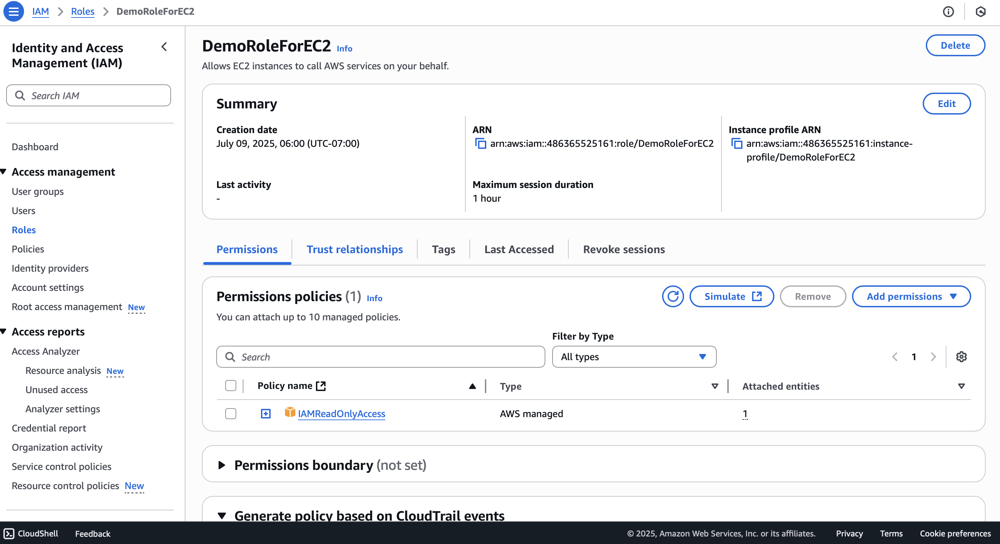

# IAM ROLES HANDS ON

## From the left hand side you click on roles

## as you can see some roles may have already been created for your account

## lets create a role

## for this exam you will need an aws service, so lets choose that one

## and then we need to choose for which service we need to apply that role, there are many roles like EC2, LAMBDA

## now we need to attach a policy , lets add READONLYACCESS

## we provide role name, we provide DemoRoleForEC2

## and then we select the trusted entities

## DemoRoleForEC2

