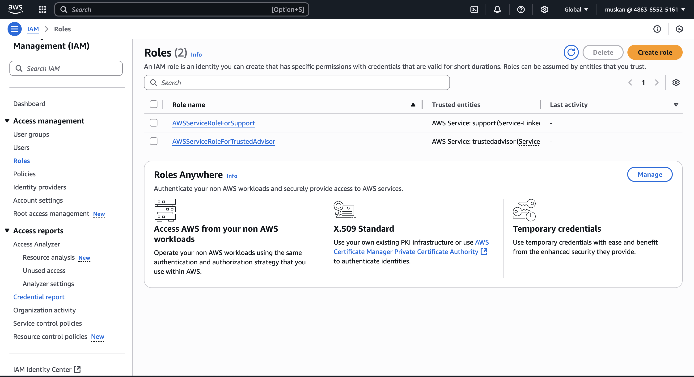
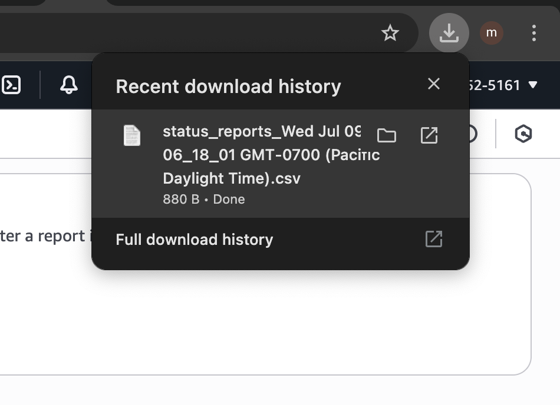
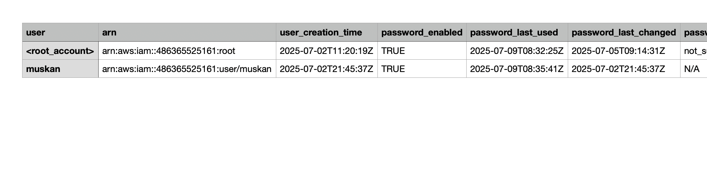
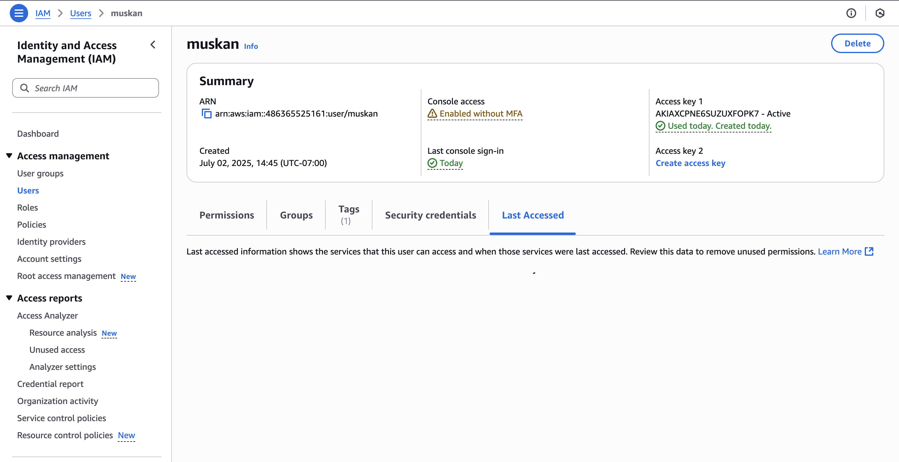
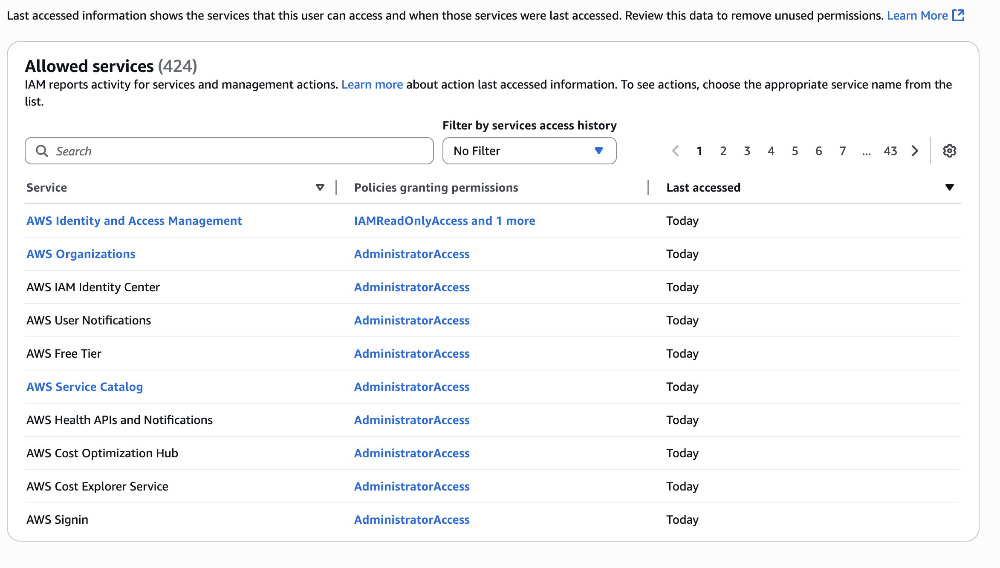
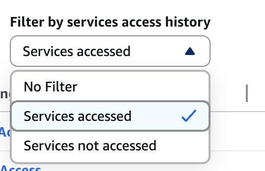
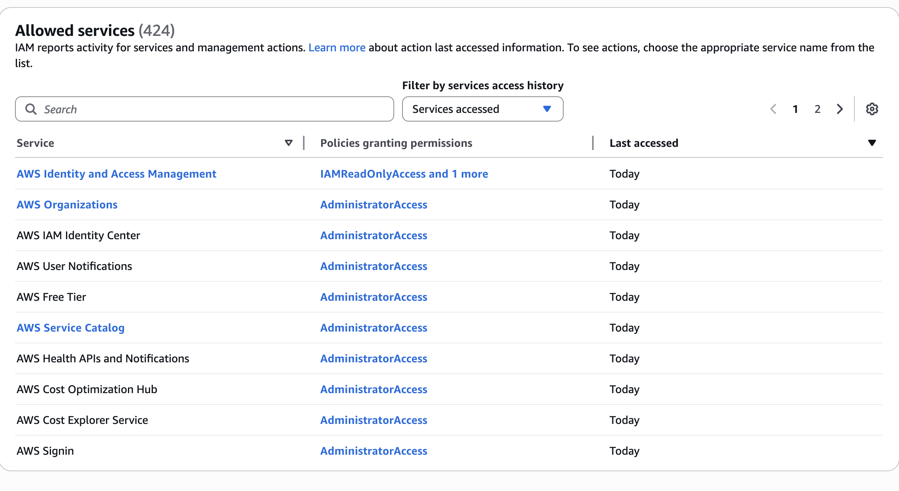
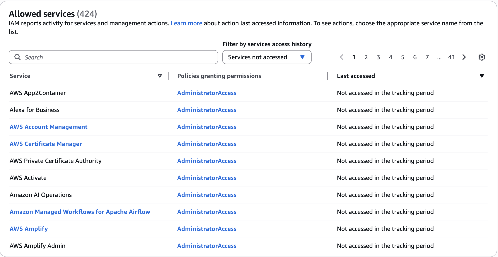

# IAM SECURITY TOOLS HANDS ON

## IAM CREDENTIALS REPORT

### go to the credentials report on the left side

### this downloads a csv document

### we get to see a credentials report like this

## ACCESS ADVISOR

### click on the filter

## it shows services acessed

## services not accessed

