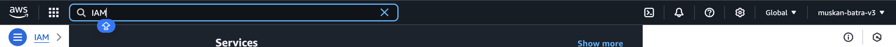
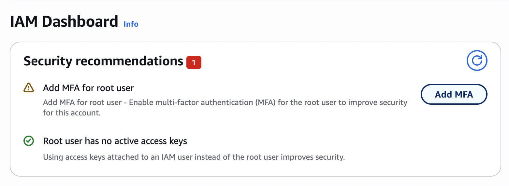
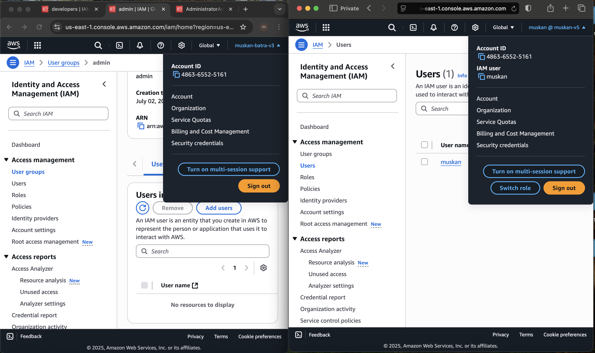

# STEPS TO CREATE IAM USERS

## In the search bar of the console search IAM, and go to the iam service dashboard

## Upon arriving on the IAM DASHBOARD, we have some security recommendations that we can for now not care about

## On the left hand side of the IAM DASHBOARD we go to users

So this dashboard is where we are going to create our users

## IAM is a global service, therefore there is no region to be selected

## When you create a user in IAM it will be global, it will be available everywhere, and therefore no region needs to be selected.

## but some other consoles that we see over here will be region specific.

# Why do we create Users?

## Well we create users beacuse right now we are using what is called the root User, which is not the best practise

## Click on create user button

## Add a username

## click the checkbox for Provide user access to AWS mangement console

## click the radiobutton for I want to create an IAM User

## click the autogenerated password and , and user must create a new password at next sign-in

## Next we have to add permissions to this User or get started with groups.

## Now we create a group , the group name is going to be admin and policy name is going to be admnistrator access

## Now that this is done,we can add the user into the admin group, now click on next

## Now we have tags as well

## Tags are everywhere in aws they are optional, but they allow you to give metadata to many of your resources

## Now we can email signin instructions or download csv file, so we can login with this user later

## But first lets return to the user list and have a look at everything

## click on create user

## lets return to the user list

## if we go to permisiions

## It has been attached via the group admin

## Muskan inherited permission of the group admin it is in, and this is why we put users in group

# now we want to sign in with our user muskan

## AWS user has an

### account id

### sign-in Url

## You can customize this Sign-in URL very easily by creating an account alias

click on create under Account Alias

## Now paste this sign-in url in a private window on safari web browser

## On the left side we have the IAM USER on the right side we have Normal AWS User[text](<../../../Section5: EC2 FUNDAMENTALS/2: EC2 Basics copy 5>)

