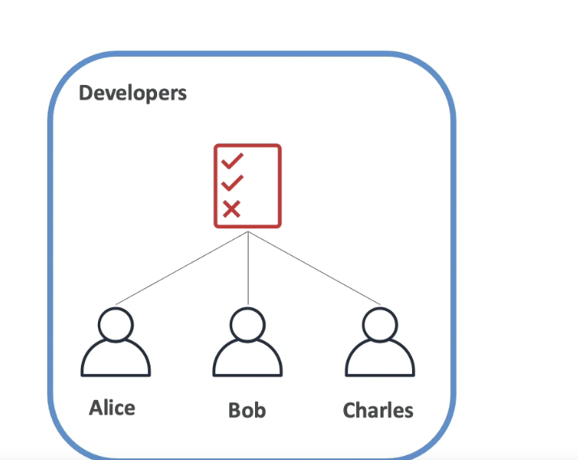
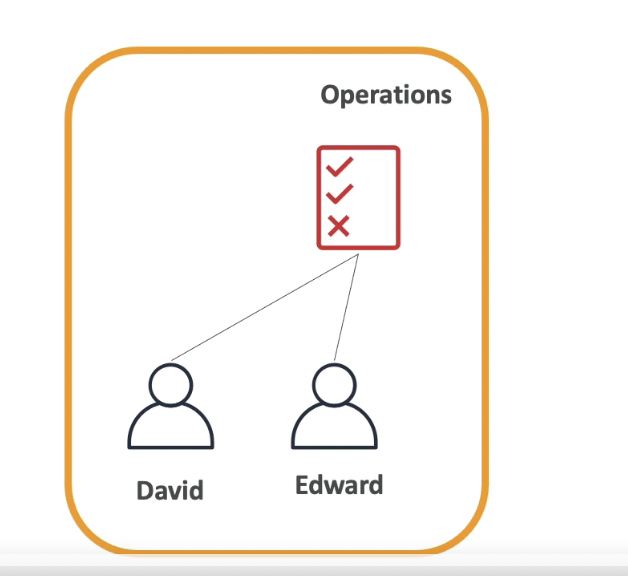
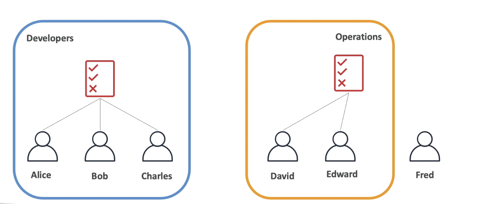
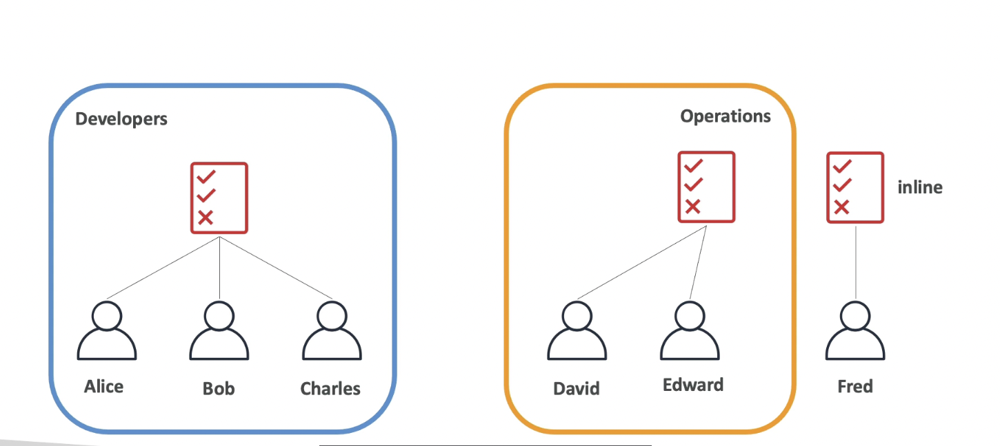
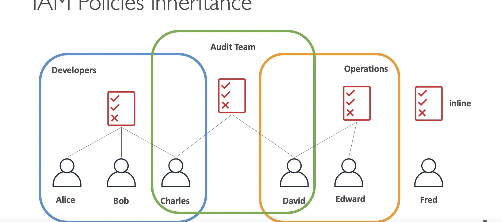
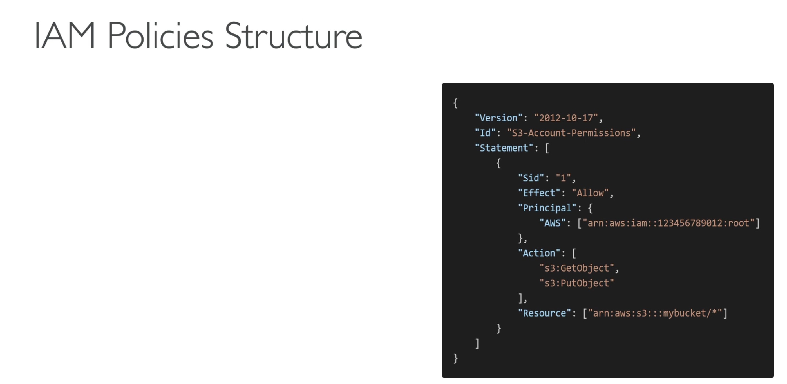

# IAM: POLICIES INHERITENCE

## Lets Imagine we have a group of developers Alice , Bob and Charles, and we attatch a policy at the group level.

## In that case policy will get applied to every single member of the group, so both Alice Bob and Charles they will all get access and inherit this policy.

## If you have a second group of operations with different policy.

## David and Edwards will have a different policy than the group of developers.

## If Fred is a User

## It has a possibility to not to belong to a group

## And we have the possibility to create whats called an inline policy which has a policy , thats only attached to a user

## Alice Bob and Charles work together hence they are all developers.

## David and Edward are in the operations group.

## Users dont have to belong to group , and user can belong to multiple groups.

## For example: Fred here

## If Charles and David work together, you can create another group of Group: AUDIT TEAM

## If Charles and David will inherit policies from the AUDIT TEAM, and from operations and Developers Team as well.

# IAM: POLICIES STRUCTURE

# Consits of:

## VERSION: Policy Language version , always include "2012-10-17"

## ID: An identifier for the policy (optional)

## STATEMENT: one or more indiviadual statements (required)

# Statements Consists Of:

### SID: An identifier for the statement(optional).

### EFFECT: Whether the statement allows or deny access(Allow, Deny).

### PRINCIPLE: Account/user/role to which this policy applied to .

### ACTION: List of actions this policy allows or denies.

### RESOURCE: List of resources to which the action are applied to .

### CONDITION: Conditions for when this policy is in effect (optional).
