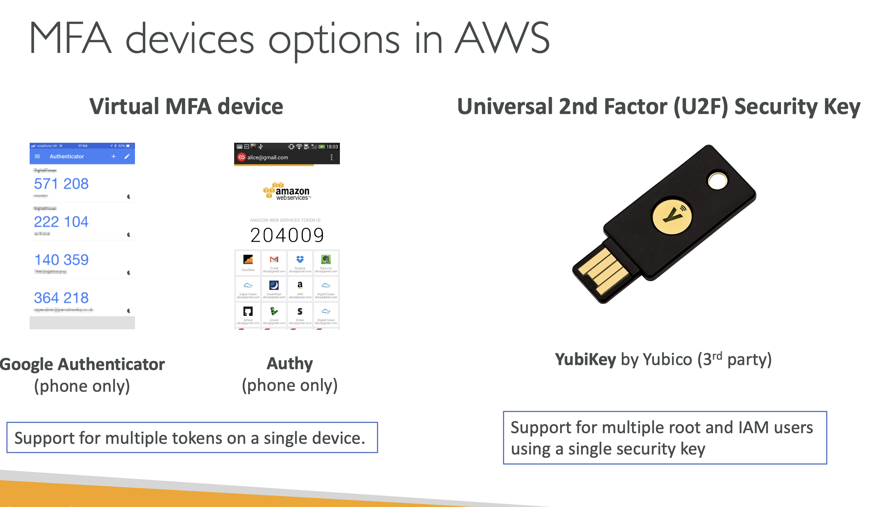

# IAM: MFA OVERVIEW

# IAM: Password Policy

## Strong Passwords = higher security for your account

## In AWS, you can setup a password policy:

### Set a minimum password length

## Require specific charachter types

### including uppercase letters

### lowercase letters

### numbers

### non-alphanumeric charachters

## Prevent password reuse

# Multi Factor Authentication(MFA)

## Users have access to your account and can possibly change configurations or delete resources in your AWS account.

## You want to protect your Root Accounts and IAM Users

## MFA = password you know + security device you own

## Lets take fir example : Alice

## She knows her password + MFA so, she will be able to make a sucessful login on MFA

# Main Benefit of MFA:

## If a password is stolen or hacked the account is not compromised

# MFA devices option in AWS:

## Virtual MFA Device

### Google Authenticator(phone only )

### Authy(phone only )

## Universal 2nd Factor (U2F) Security Key for example a YubiKey by yubico(3rd Party)

### It supports for multiple root and IAM users using a single security key

## Hardware Key Fob MFA Device

## Hardware Key Fob MFA Device for AWS GovCloud(US)

