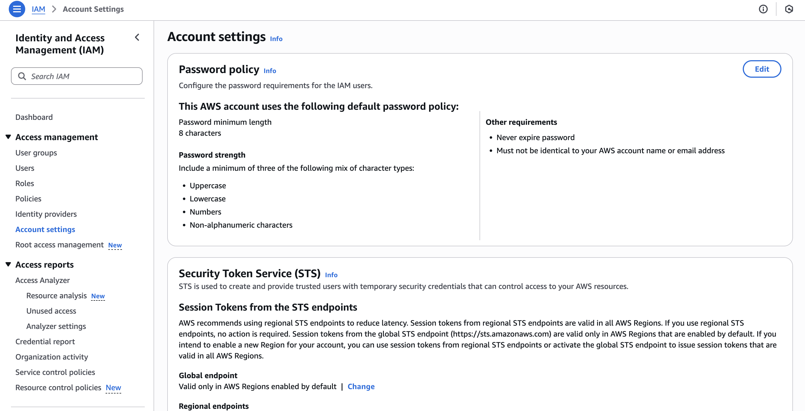
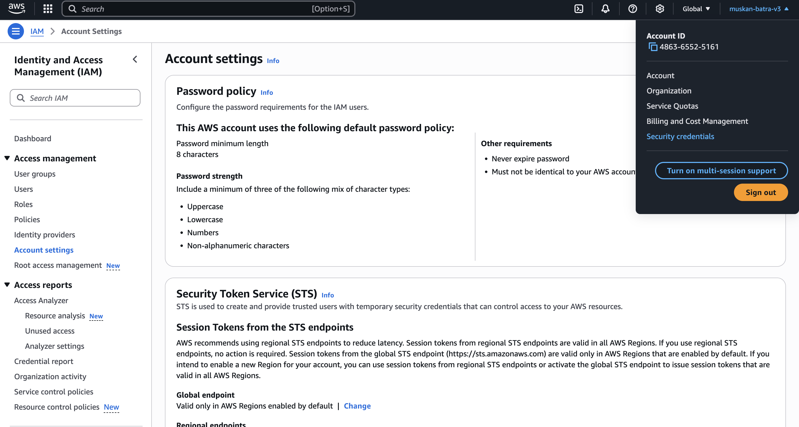
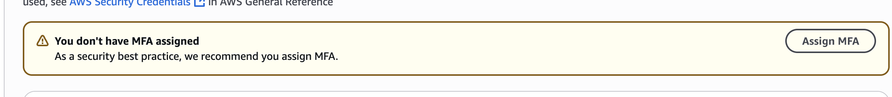
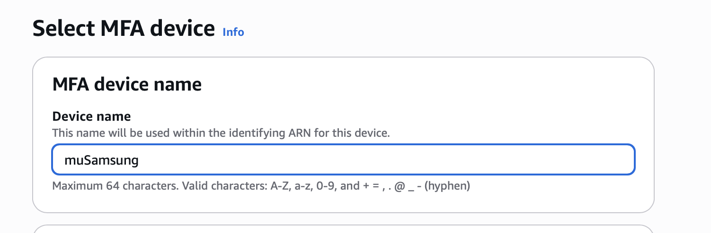
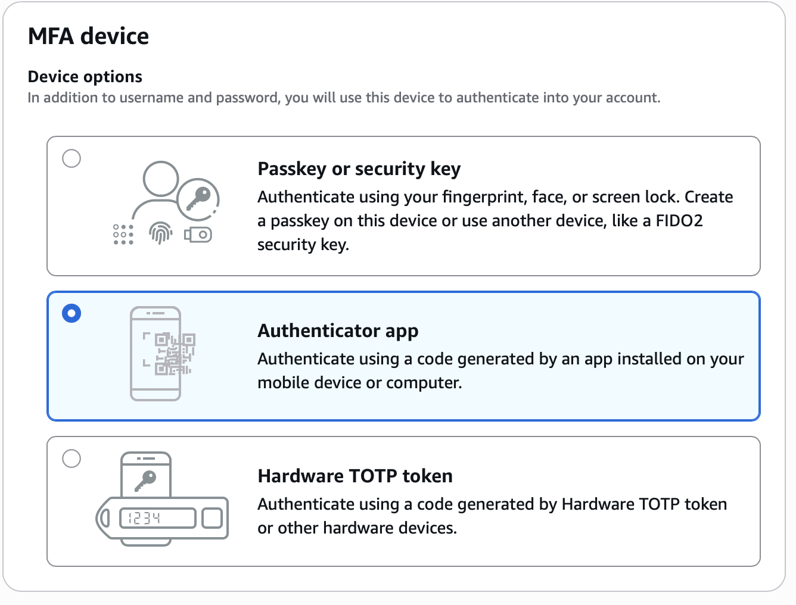
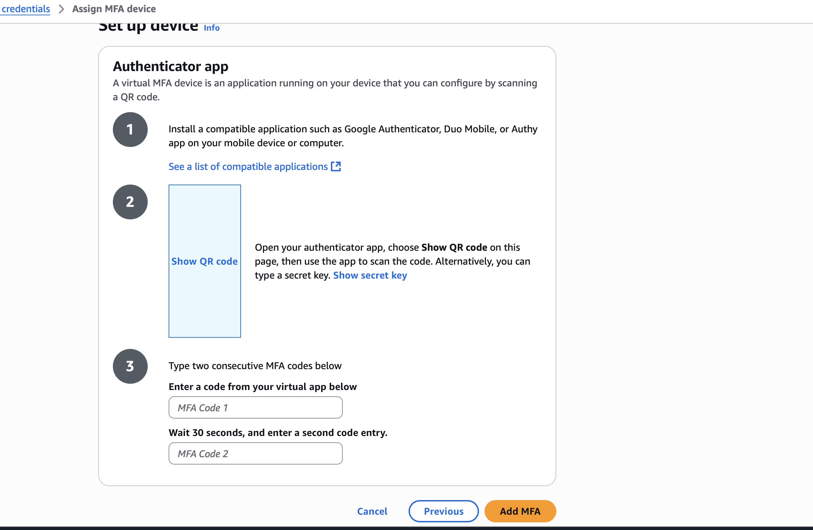
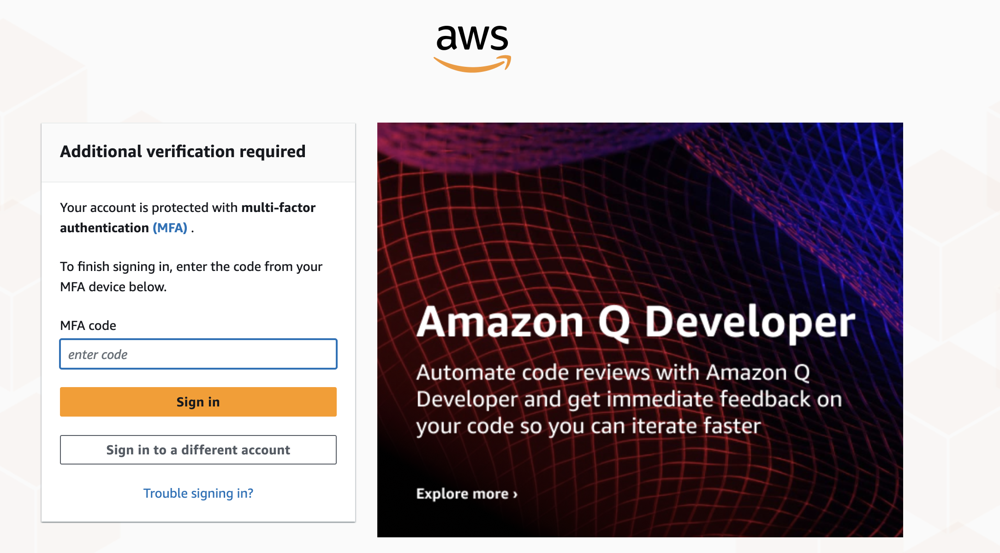

# IAM: MFA HANDS ON

## Lets Define a password policy

## Root Account: Go to Account Settings on the left hand side

# 1ST PART

## We can do varoius things like setup password length , lowercase , uppercase

# 2ND PART - MULTI FACTOR AUTHENTICATION

## Go to account name then => security credentials

## You will see

## click on ASSIGN MFA

## Add MFA Device Name

## Lets select an authenticator app , because its virtual

## Lets add the codes

## Now if you login you will have to add an MFA code

