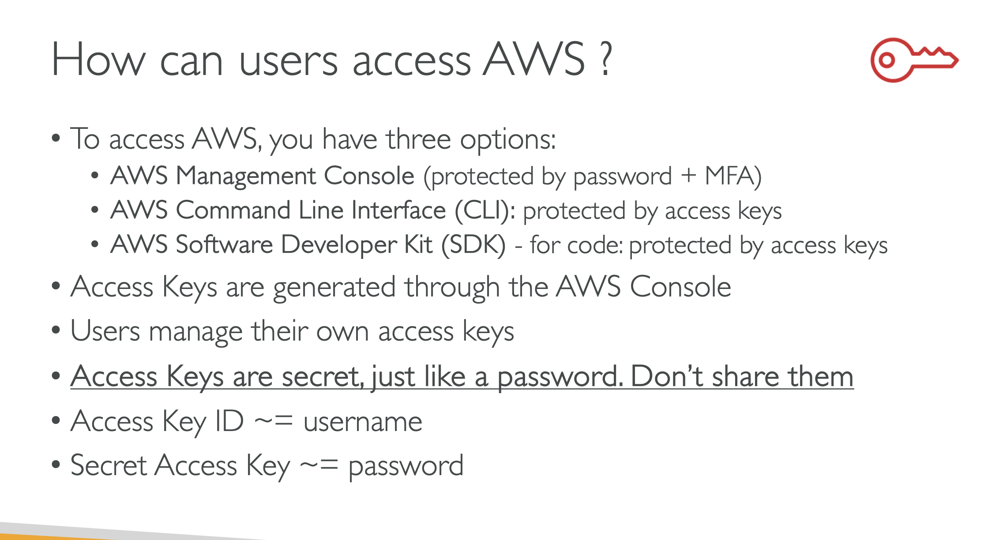
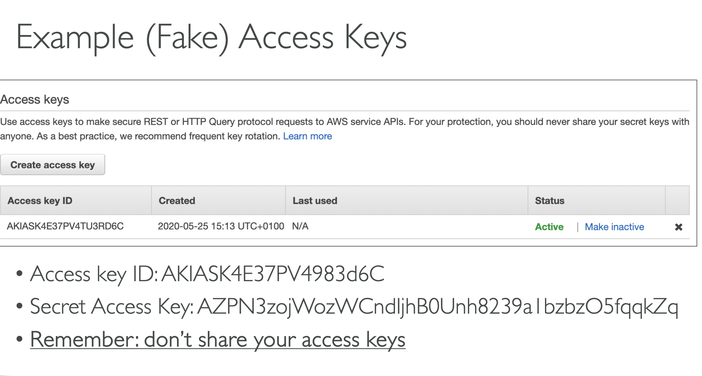
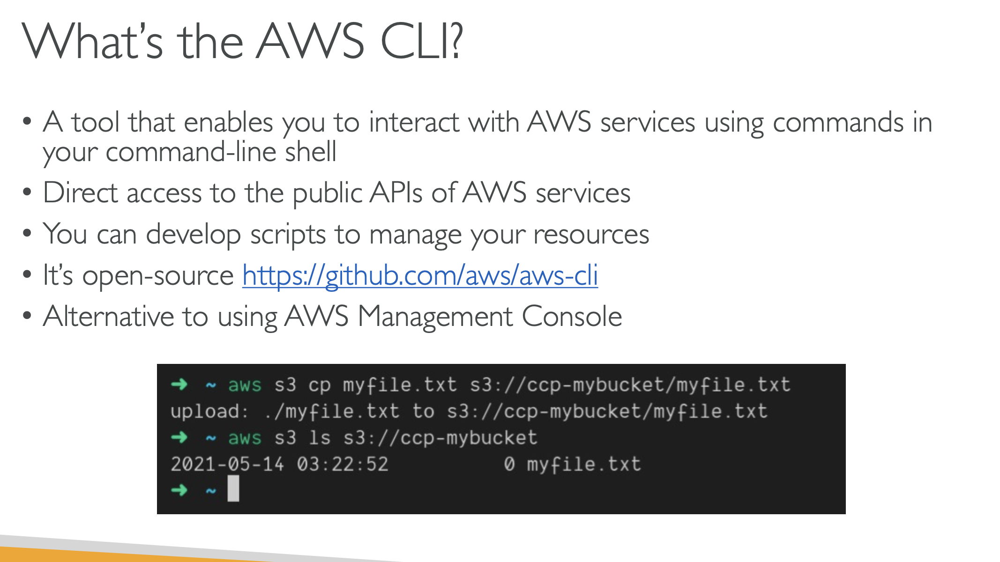
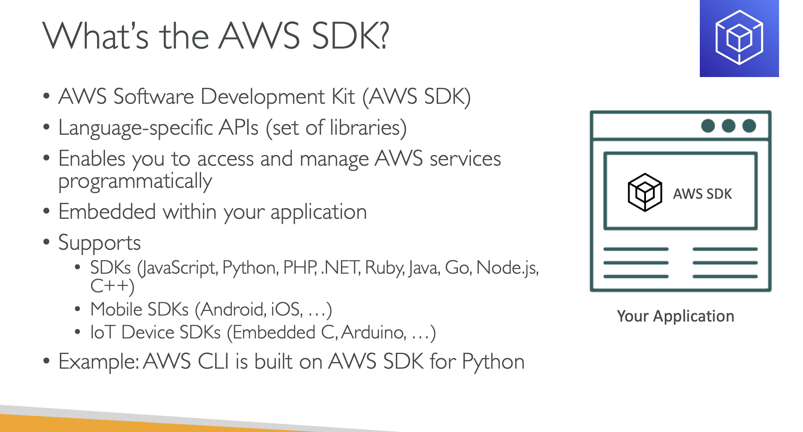

# How can USERS ACESS AWS?

## To access AWS , you have three options:

### AWS Management Console(protected by password + MFA)

### AWS Command Line Interface(CLI): protected by access keys

### AWS Software Development Kit(SDK)- for code: protected by access keys

## How to generate Access Keys:

### Access keys are generated through the AWS Console

### Users manage their own access keys

### Access Keys are secret just like password . Dont share them

# What's the AWS CLI?

### A tool that enables you to interact with AWS services using commands in your command line shell

### Direct access to public APIS of AWS services

### You can develop scripts to manage your resources

### AWS Cli is open source

### Alternative to using the AWS management console

# What's the AWS SDK?

### AWS Software Development Kit(AWS SDK)

### Language Specific APIS(set of libraries)

### Enables you to access and manage AWS services programmatically

### Embedded within your application

### Suuports SDKS(JavaScript, Python, PHP , .NET Ruby, Java , GO, Node.js,C++)

### Mobile sdks (ANDROID,IOS,..)

### IOT Device SDK(Embedded C, Arduino,...)

## Example: AWS CLI is built on AWS SDK for Python

