# AWS CLI Hands on

## How To Create Access Keys

### Lets Click on the username Muskan

[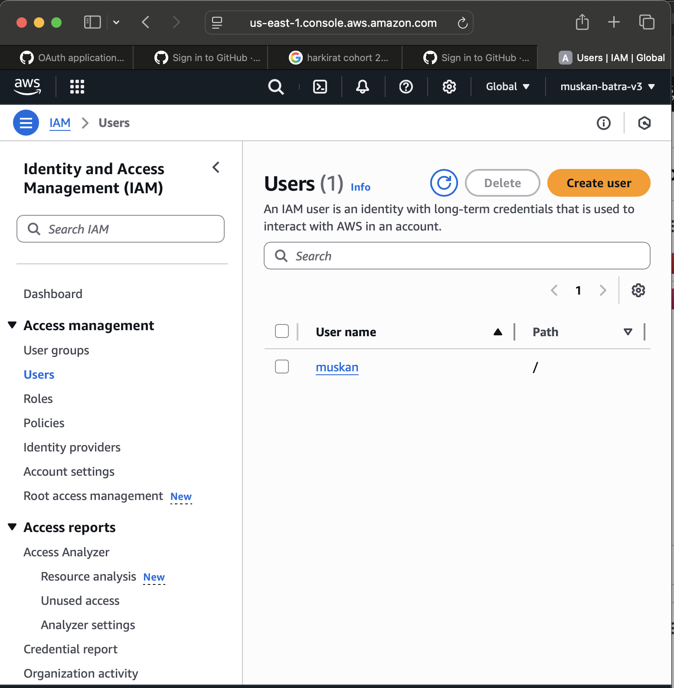](../Slides/Slide1.png)

### Lets Go into Security Credentials

[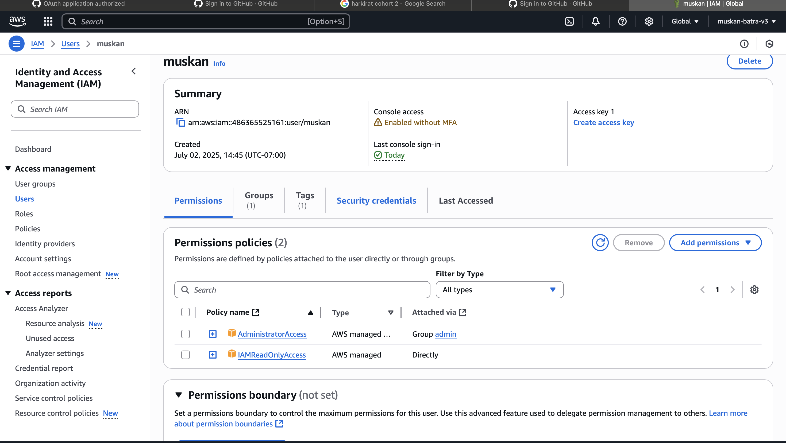](../Slides/Slide2.png)

### Create Access Key

[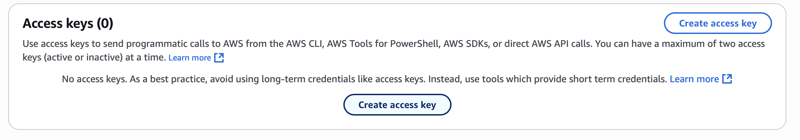](../Slides/Slide3.png)

### click on cli and then i understand checkbox

[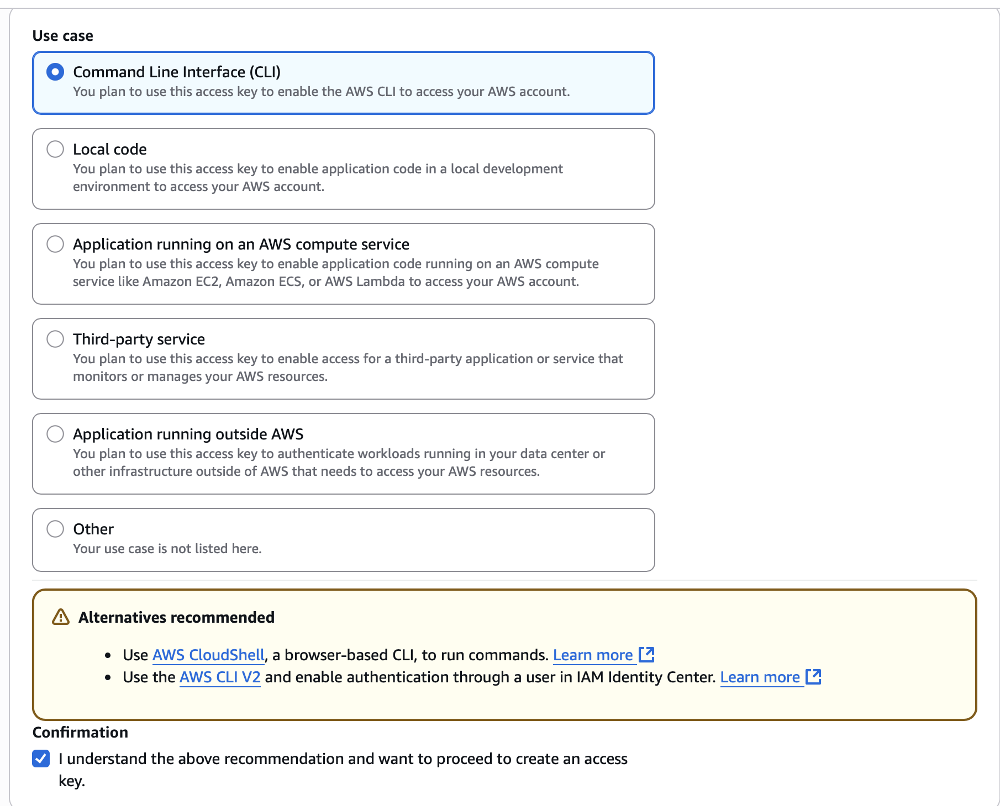](../Slides/Slide4.png)

### click on Next and Create acess Key

[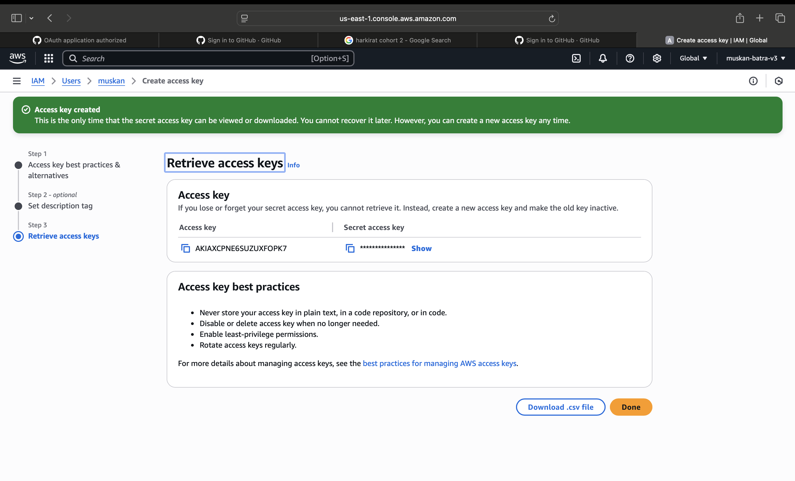](../Slides/Slide5.png)

# AWS CLI HANDS ON

## type aws configure in the terminal

[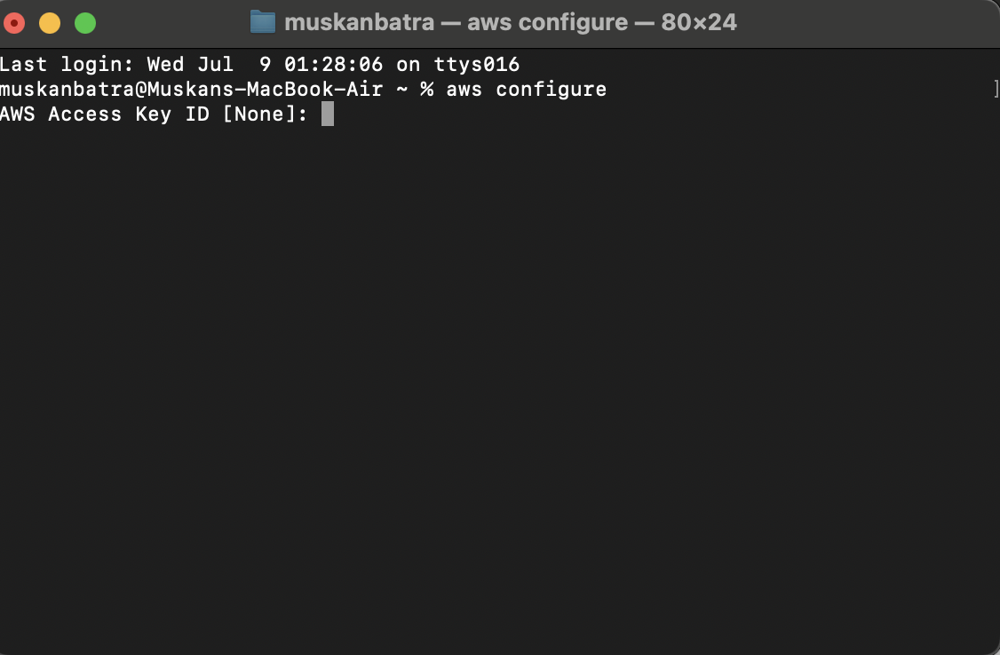](../Slides/Slide6.png)

## copy this access key and past in the terminal

[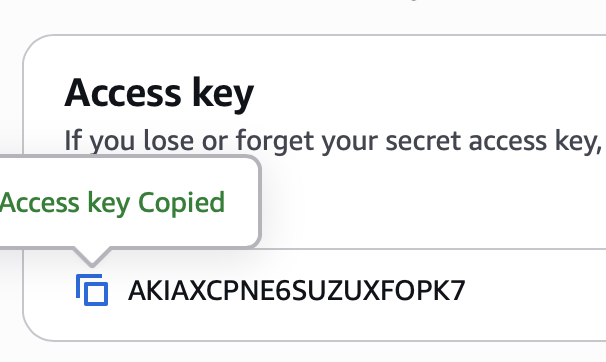](../Slides/Slide7.png)

## copy the secret access key from the console and paste in the terminal

[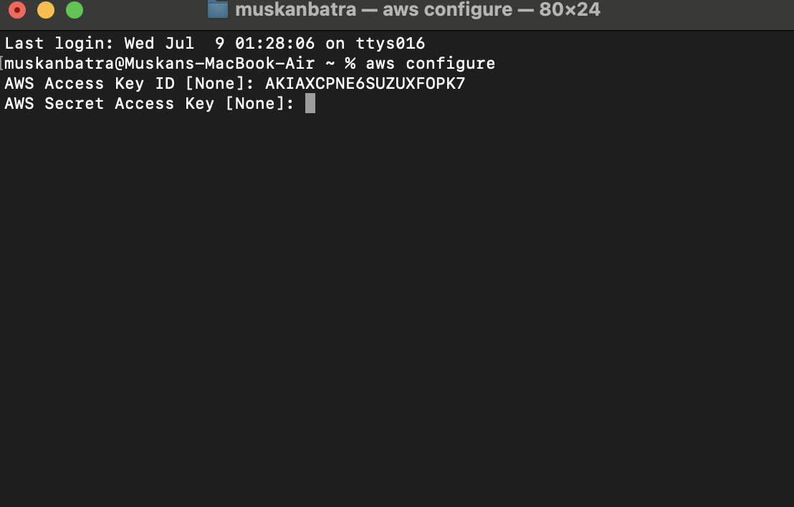](../Slides/Slide8.png)
[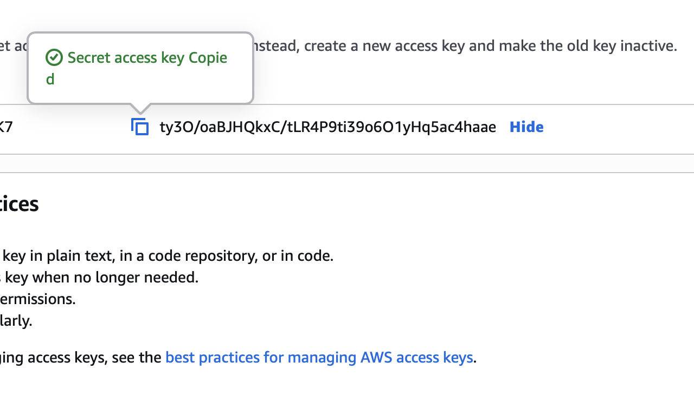](../Slides/Slide9.png)

## add the default region name

[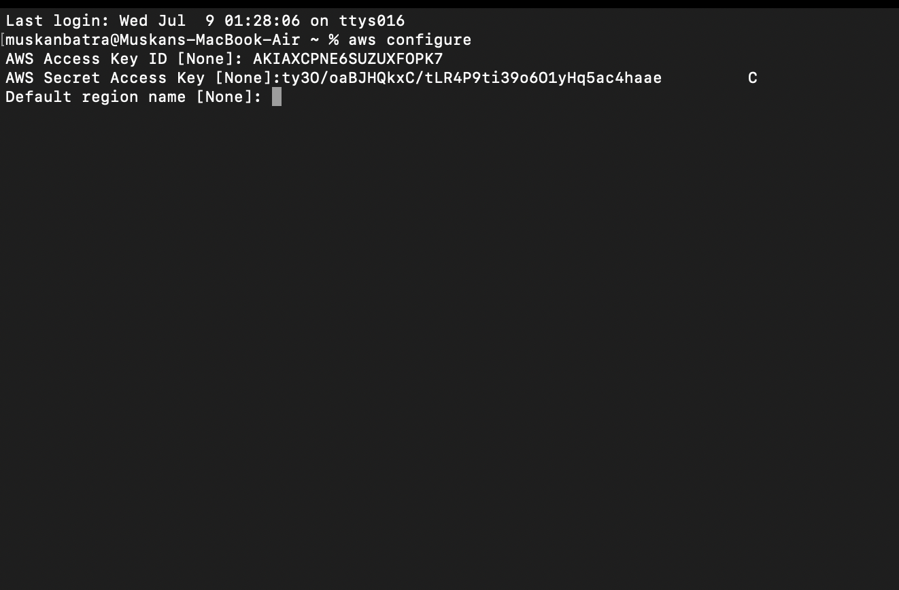](../Slides/Slide10.png)
[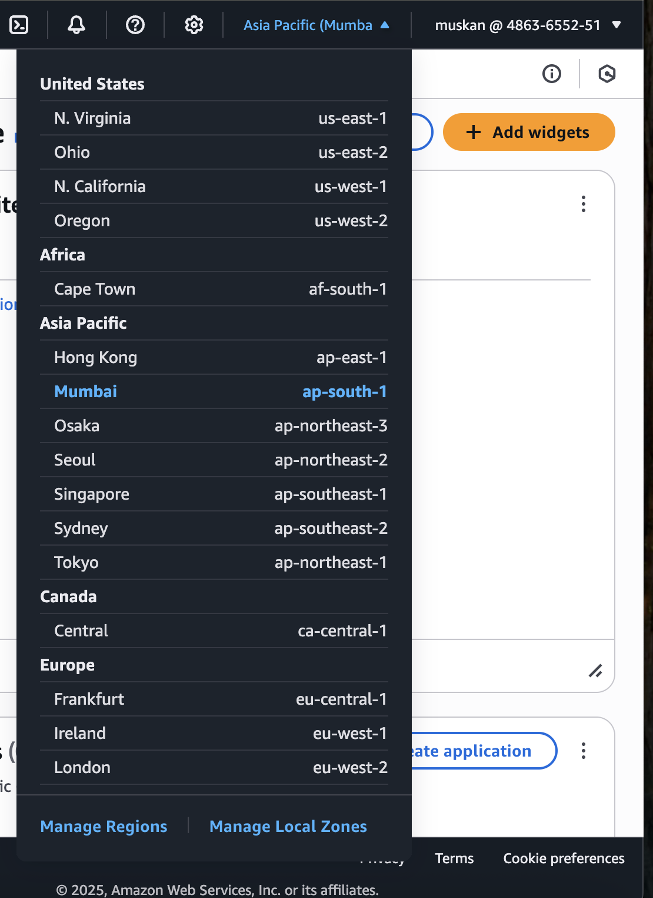](../Slides/Slide12.png)
[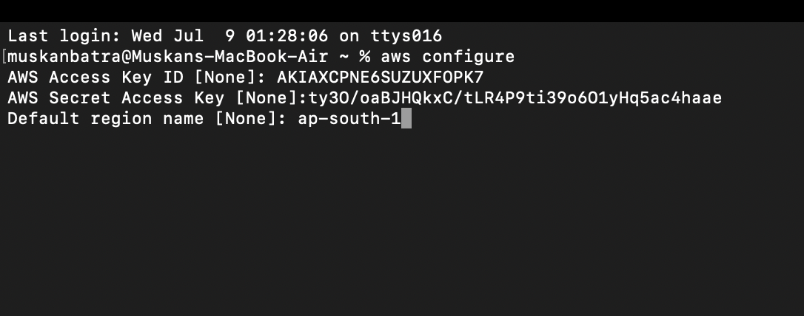](../Slides/Slide11.png)

## press enter on default output format

[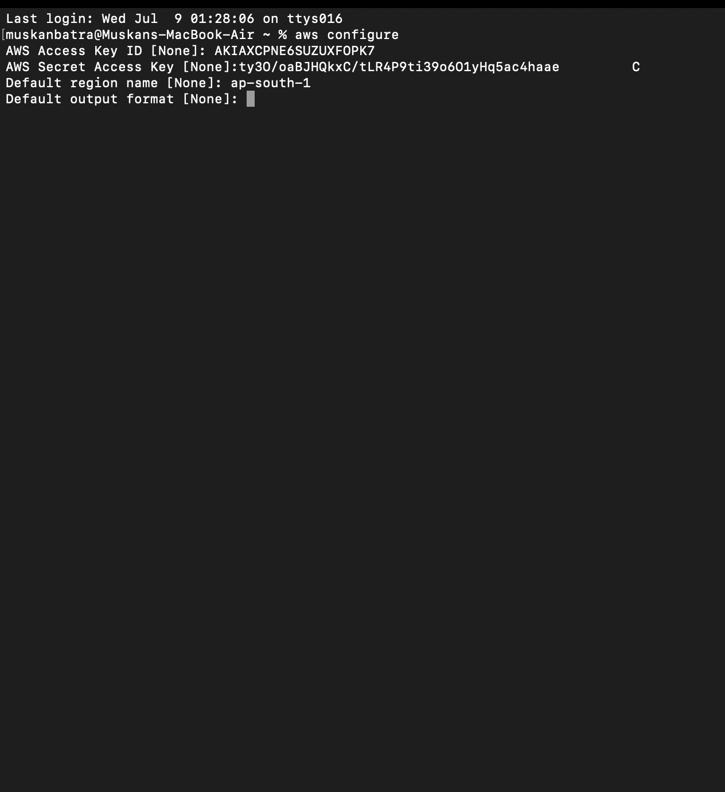](../Slides/Slide13.png)

# So now the aws cli is configured

## type command to see if its working

### aws iam list-users

[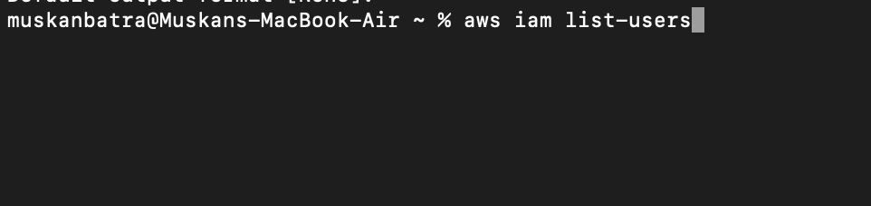](../Slides/Slide14.png)
[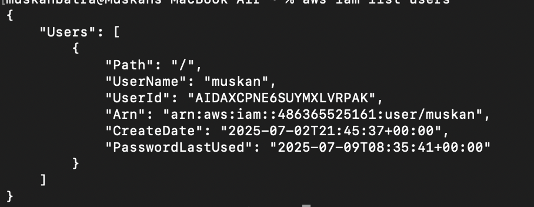](../Slides/Slide15.png)
