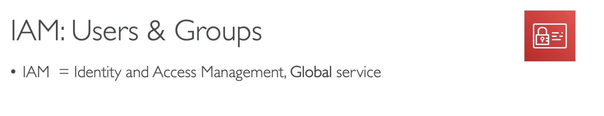
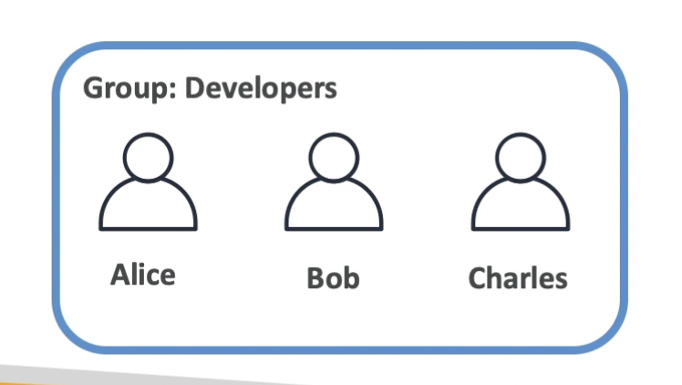
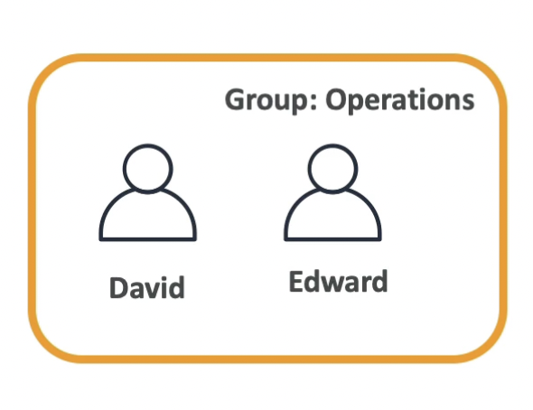
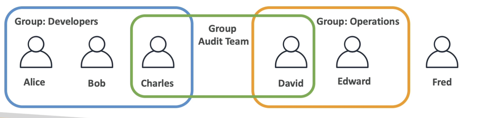

# IAM: USERS & GROUPS

## IAM = Identity and Access Management, It is a Global Service beacuse in IAM, we are going to create our users and assign them to group.

## Root Account: created by default , shouldn't be used or shared.

## Users are people within your organization, and can be grouped.

## Groups can only contain users , not other groups.

## Lets take an example:

## We have Alice ,Bob, charles, David, Edward and Fred.

## Alice Bob and Charles work together hence they are all developers.

## David and Edward are in the operations group.

## Users dont have to belong to group , and user can belong to multiple groups.

## For example: Fred here

## If Charles and David work together, you can create another group of Group: Audit Team

## Why do we create users and why do we create groups?

### Because we want to allow them to use our AWS accounts, and to allow them to do so we have to give them permisiions.

### USERS OR GROUPS: can be assigned json documents called policies

### These policies define the permisiions of the users

### These policies define the permisiions of the users

### In AWS you apply the LEAST PRIVILEDGE PRINCIPLE: dont give more permisiion than a user needs
