# Go to Billing and Cost Management in the aws console in the IAM USER

[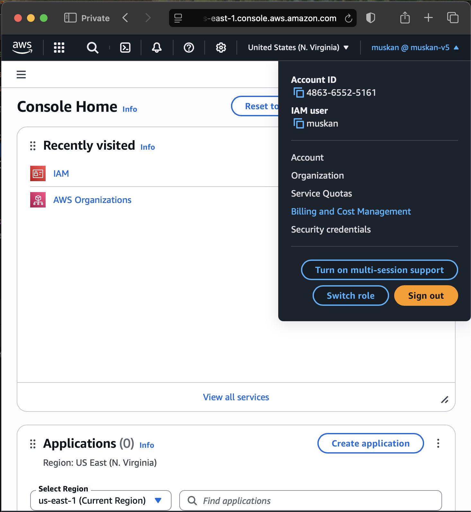](../Slides/Slide1.png)

## as you can see so much access denied here

[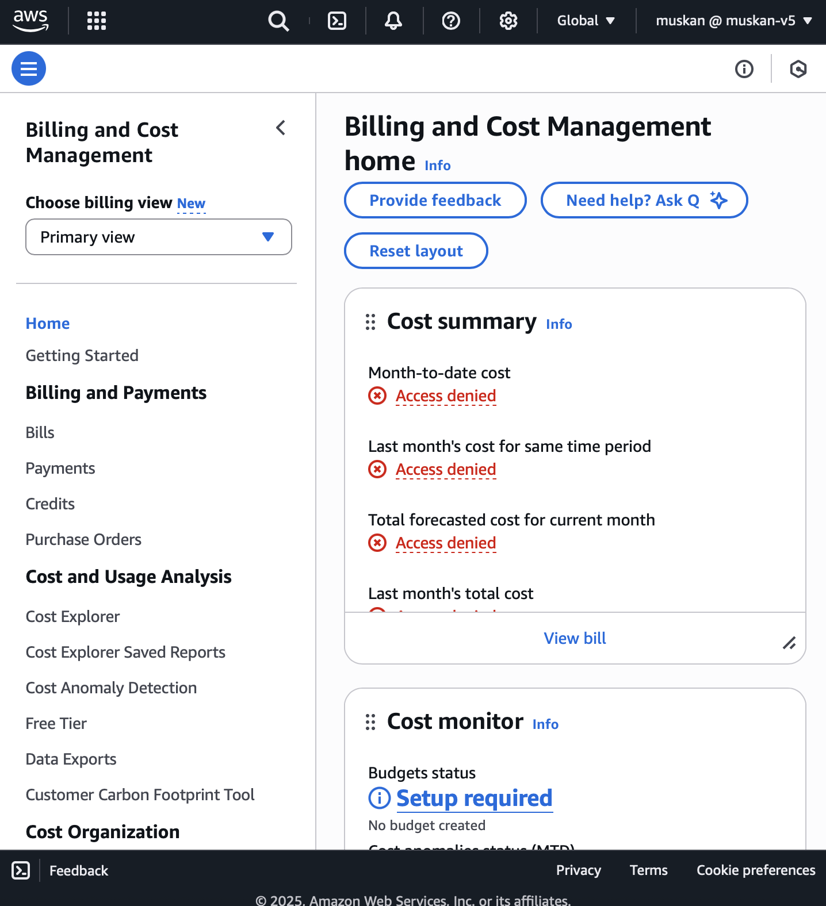](../Slides/Slide2.png)

## to fix this lets go into the root account

[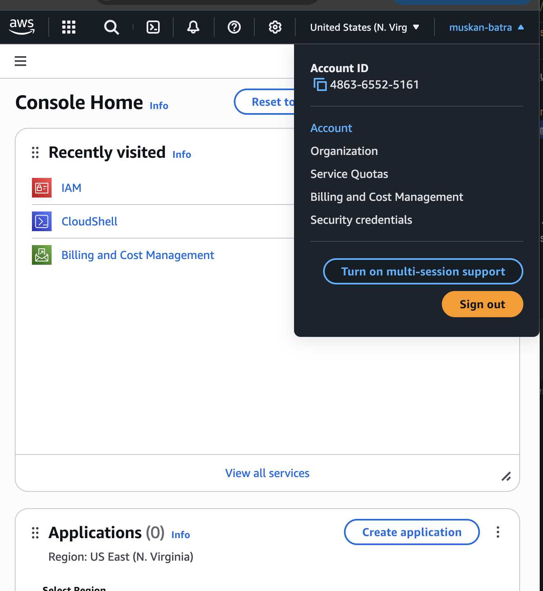](../Slides/Slide3.png)

## lets keep scrolling and we see

# IAM USER AND ROLL ACCESS TO BILLING INFORMATION

## as you can see its deactivated

[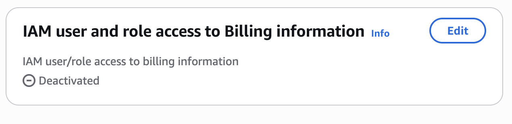](../Slides/Slide4.png)

# so we need to just activate the acess

[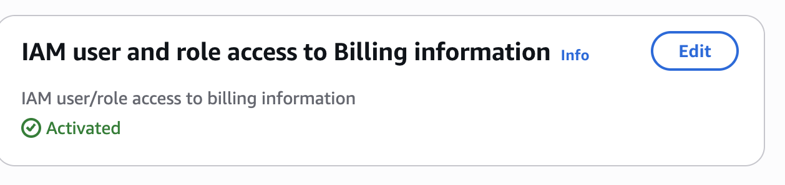](../Slides/Slide5.png)

[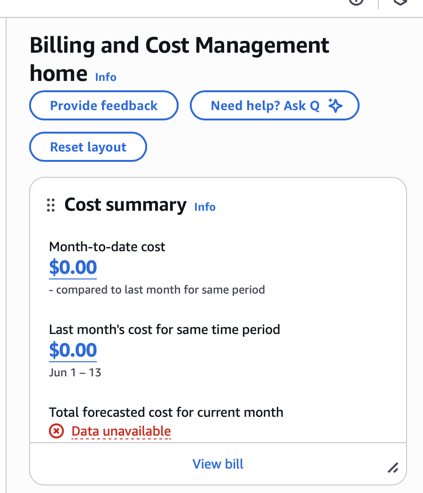](../Slides/Slide6.png)

# except for forecasted we can see all the cost information

[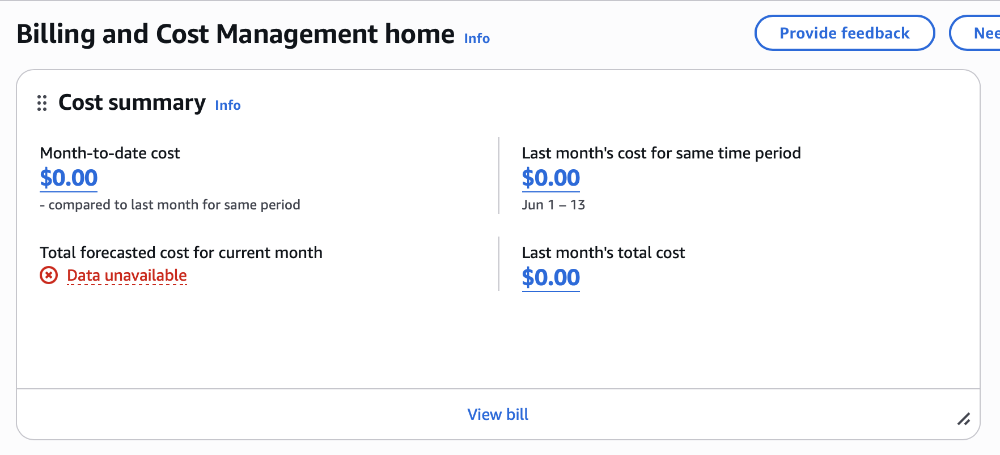](../Slides/Slide7.png)
[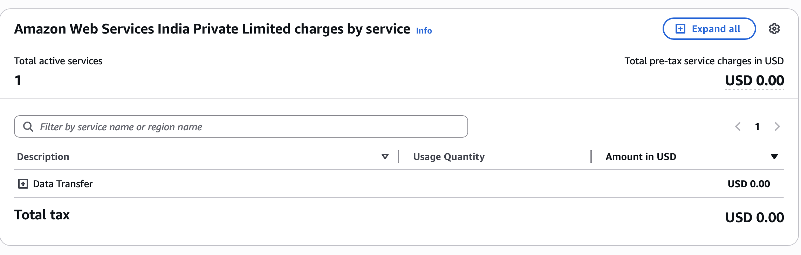](../Slides/Slide8.png)
[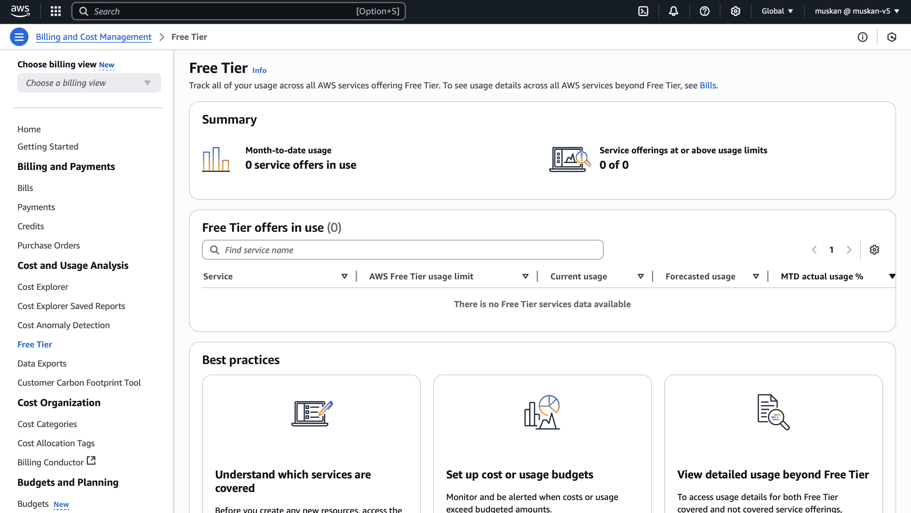](../Slides/Slide9.png)

# lets go to the budgets in the console

[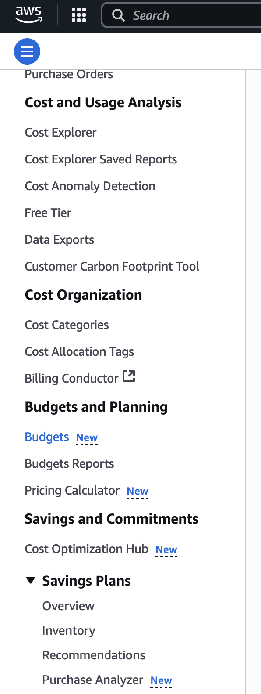](../Slides/Slide10.png)

# here you can create your budget

[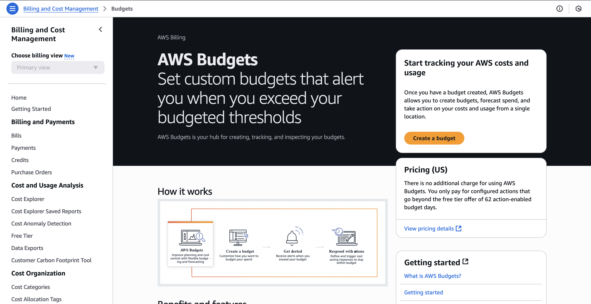](../Slides/Slide11.png)

[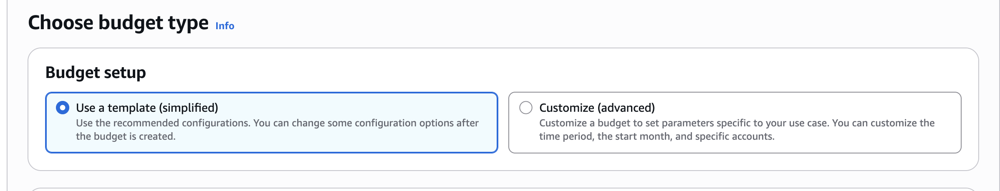](../Slides/Slide12.png)

[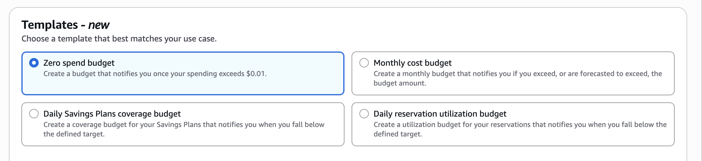](../Slides/Slide13.png)
[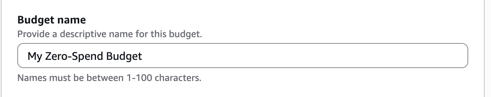](../Slides/Slide14.png)
[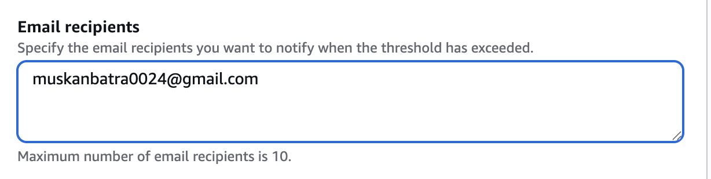](../Slides/Slide15.png)

# we can create another budget using the monthly cost budget

[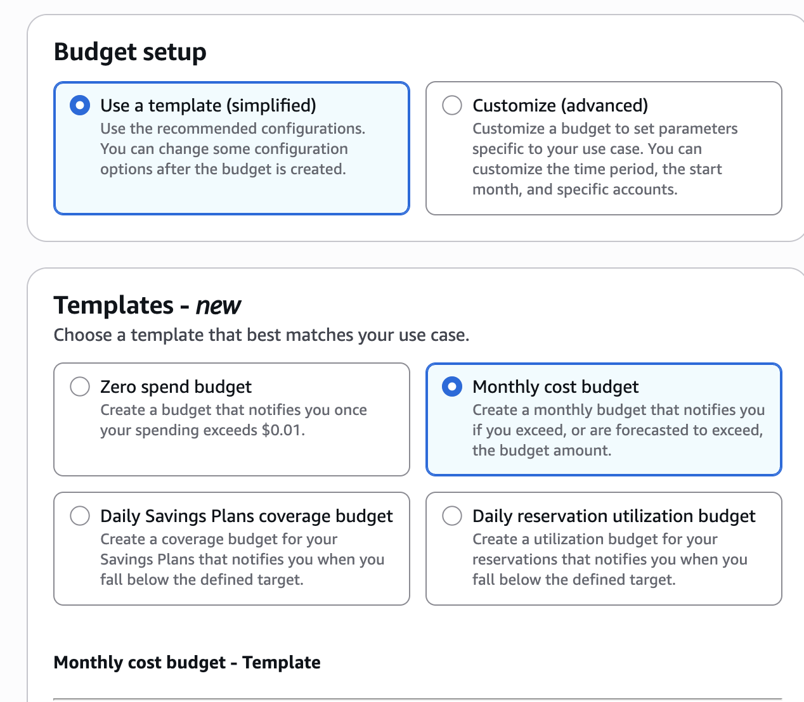](../Slides/Slide17.png)

[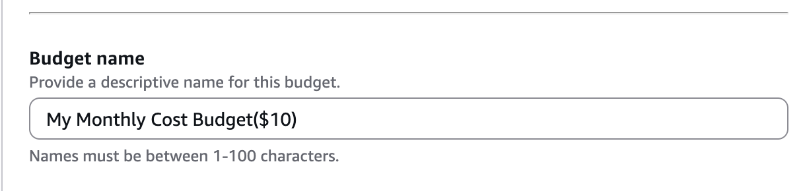](../Slides/Slide18.png)
[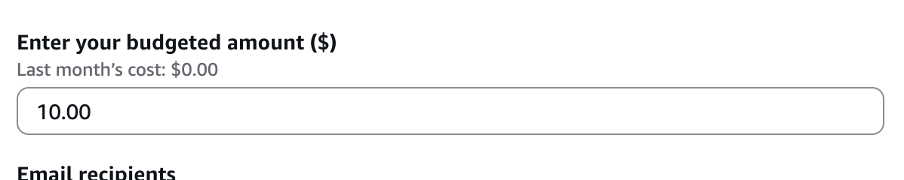](../Slides/Slide19.png)
[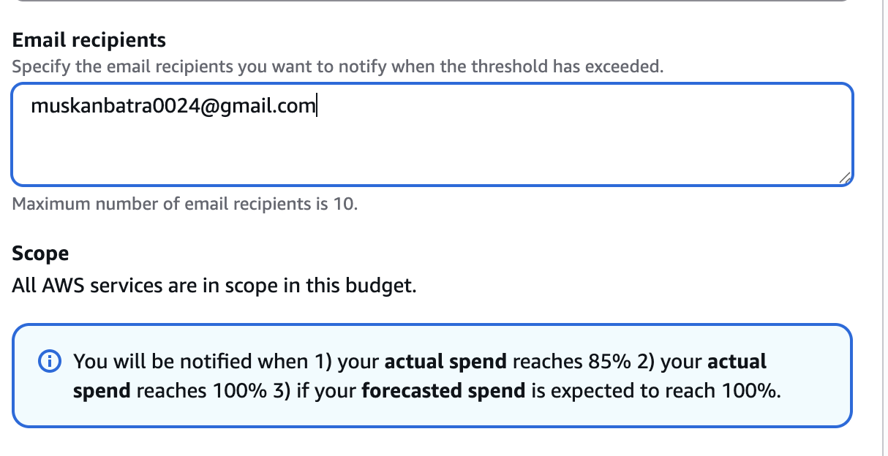](../Slides/Slide20.png)
[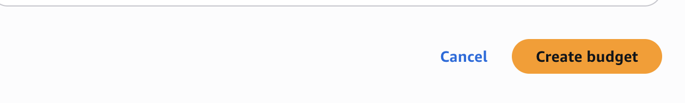](../Slides/Slide21.png)
[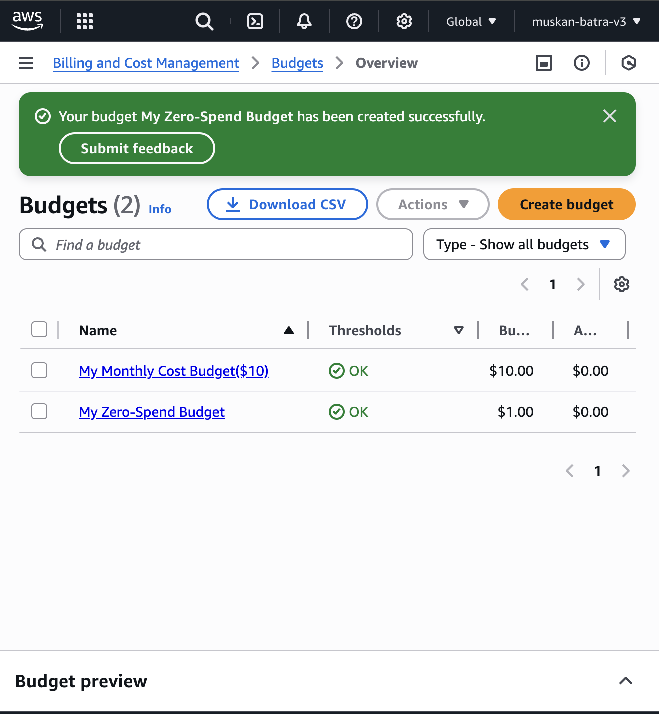](../Slides/Slide22.png)
