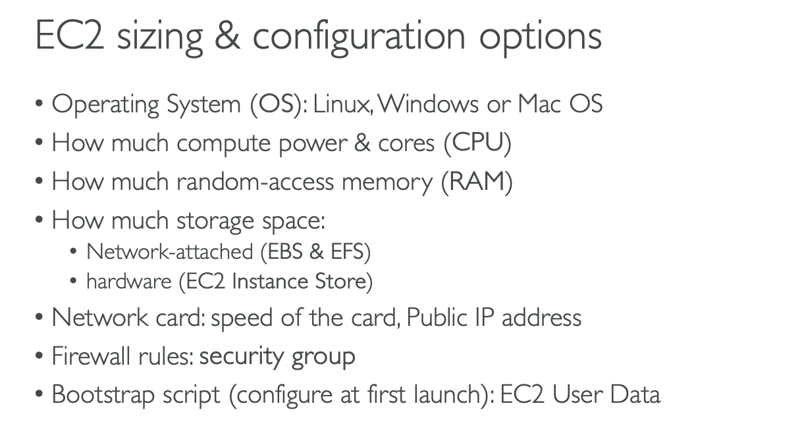
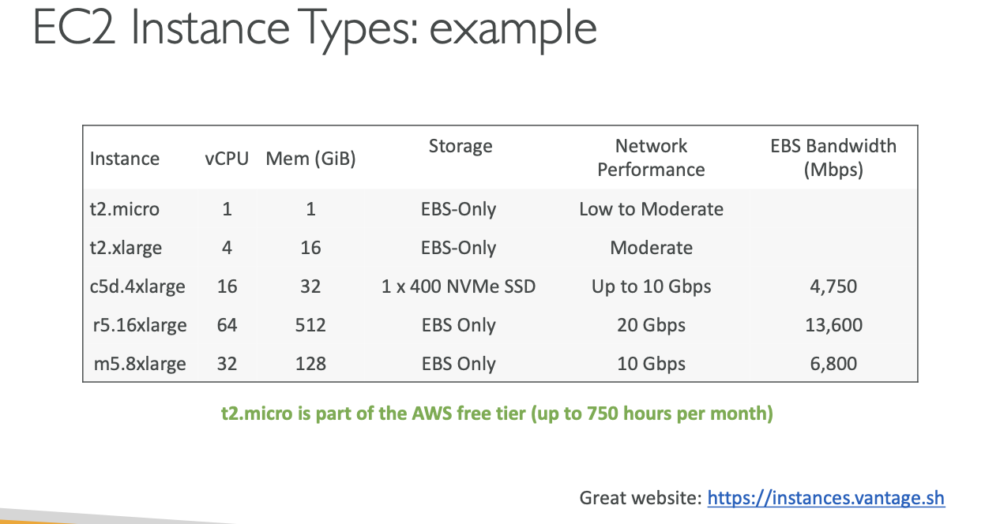

# AMAZON :EC2

## EC2 is one of the most popular of AWS Offering.

## EC2 = Elastic Compute Cloud = Infrastructure as a service

## It mainly consits in the capability of:

### Renting virtual machines(EC2).

### Storing Data on virtual drives(EBS).

### Distributing load across machines(ELB).

### Scalling the services using an auto scaling group(ASG).

# Knowing EC2 is fundamental to understand how the cloud works.

## EC2 Sizing and Configuration Options

### Operating System(OS): Linux, Windows or MACOS

### How much compute power or cores(CPU)

### How much random access memory(RAM)

### How much storage space:

Network attached(EBS & EFS)
hardware(EC2 instance Store)

### Network card: speed of the card, Public IP Address

### Firewall rules: sequrity group

### Firewall rules: sequrity group

## EC2 User Data

### It is possible to bootstrap our instances using an EC2 USER DATA script.

### BOOTSRAPING means launching commands when a machine starts

### The script is ONLY RUN ONCE at the instance FIRST START

### EC2 user data is used to automate boot tasks such as:

Installing Updates
Installing Software
Downloading common files from the internet
Anything you can think of

### EC2 user data scripts run with the root user

https://instances.vantage.sh/

