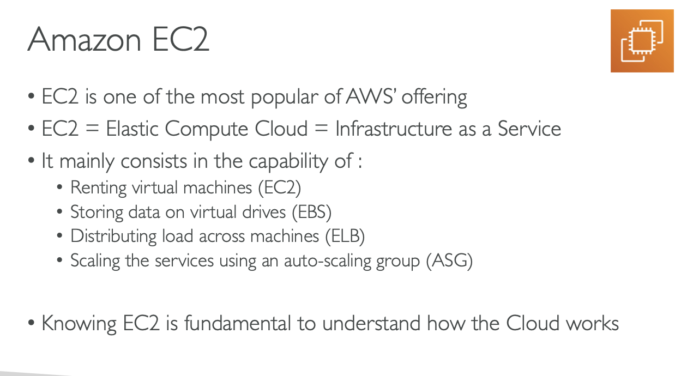

# AMAZON :EC2

## EC2 is one of the most popular of AWS Offering.

## EC2 = Elastic Compute Cloud = Infrastructure as a service

## It mainly consits in the capability of:

### Renting virtual machines(EC2).

### Storing Data on virtual drives(EBS).

### Distributing load across machines(ELB).

### Scalling the services using an auto scaling group(ASG).

# Knowing EC2 is fundamental to how the cloud works.

