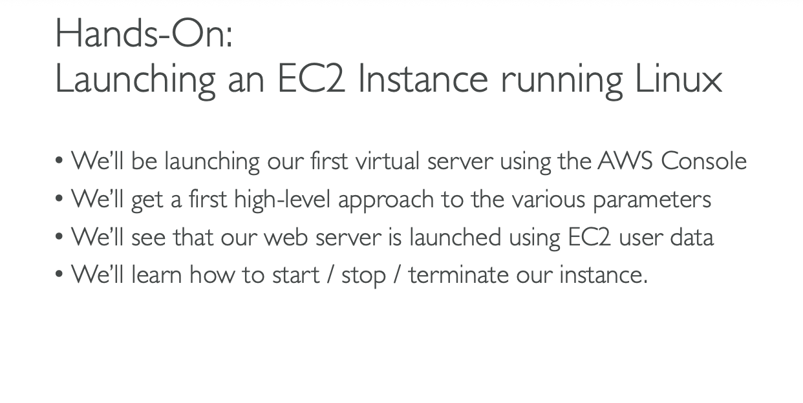

# CREATE AN EC2 INSTANCE WITH EC2 USER DATA TO HAVEA WEBSITE HANDS ON

# Hands-On: Launching an EC2 Instance running Linux

## we'll be launching our first virtual server using the AWS Console

## we'll get a first high level approach to the various parameters

## we'll see that our web server is launched using EC2 user data

## we'll learn how to start/stop / terminate our instance

