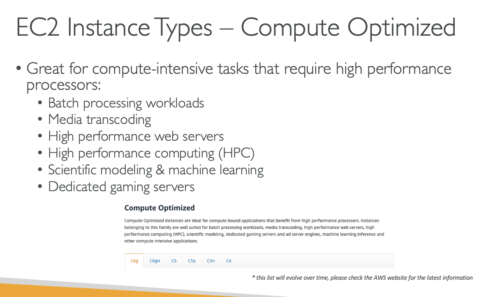

# EC2 INSTANCE TYPES BASICS

## https://aws.amazon.com/ec2/instance-types/

## m5.2xlarge

### m: instance class

### 5: generation(AWS improves them over time)

### 2xlarge: size within the instance class

# There are 7 different types of EC2 INSTANCES

# EC2 - Instance Types - General Purpose

## Great for a diversity of workloads such as web servers or code repositories

## Balance between:

### Compute

### Memory

### Networking

# EC2 - Instance Types - Compute Optimized

## Great for compute intensive tasks that require high performance processors

### Batch processing workloads

### Media transcoding

### High performace web servers

### High performace computing(HPC)

### Scientific Modelling & macine learning

### Dedicated gaming servers

# EC2 - Instance Types - Memory Optimized

## Fast performance for workloads that process large data sets in memory

## Use cases:

### High performance , relational/non-relational databases

### Distributed web scale cache stores

### In-memory databases optimised for BI(business intelligence)

### Applications performing real-time processing of big unstructured data

# EC2 - Instance Types - Storage Optimized

## Use cases:

### High frequency online transaction processing(OLTP) systems

### Relational and Nosql databases

### Cache for in-memory databases(for example Redis)

### Data warehousing applications

### Distributed file systems

### lets compare using below

### https://instances.vantage.sh/
