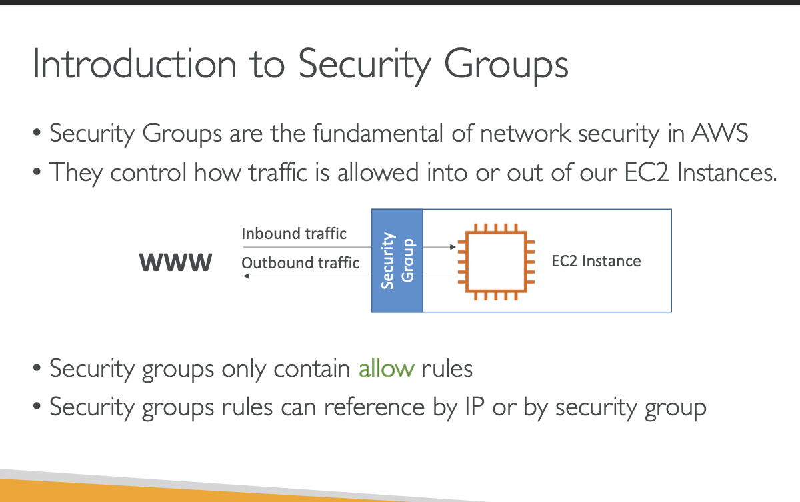
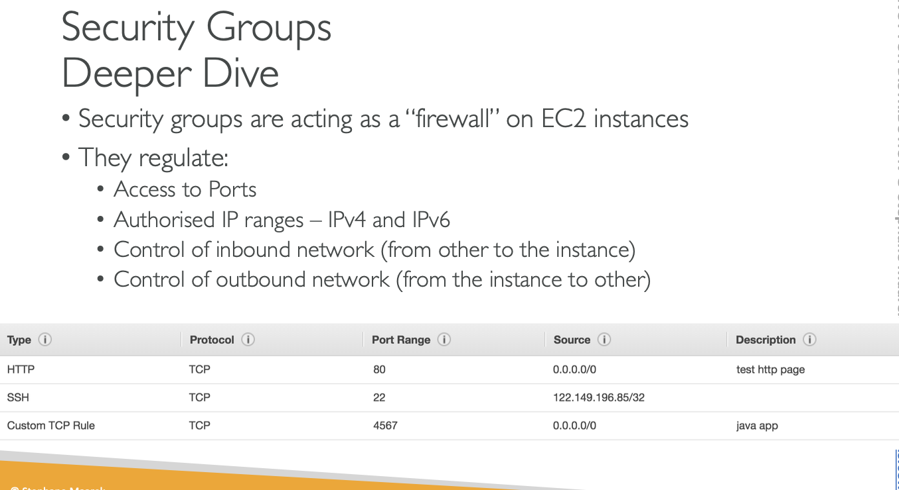
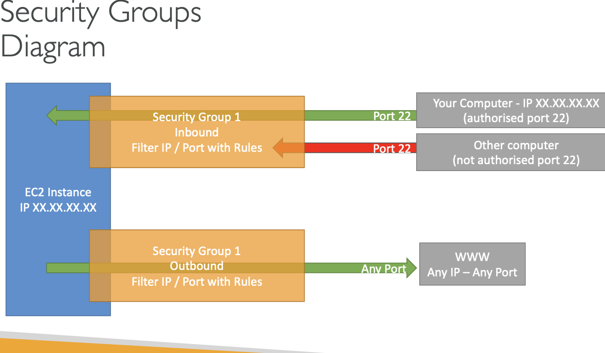
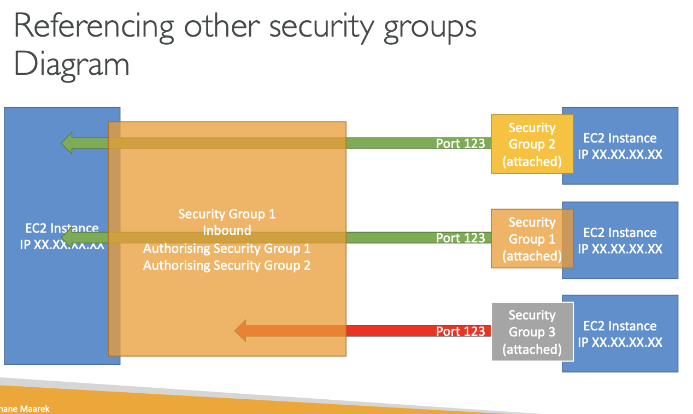
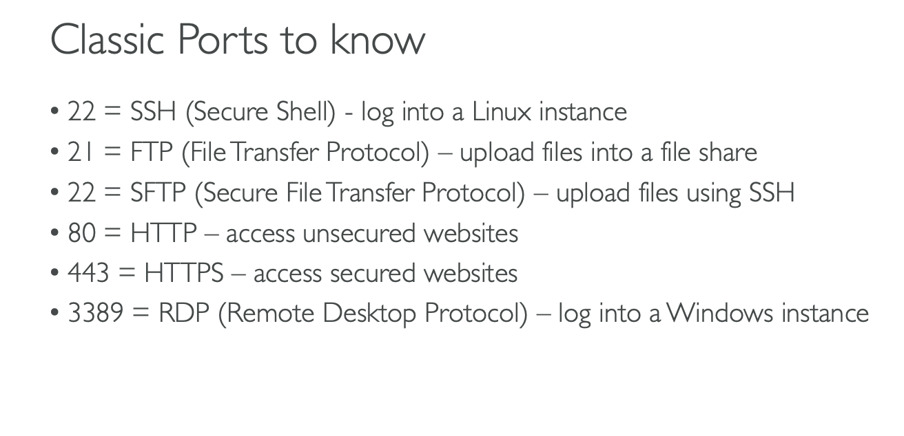

# SECURITY GROUPS AND CLASSIC PORTS OVERVIEW

# INTRODUCTION TO SECURITY GROUPS

## Security Groups are fundamental of network security in AWS cloud

## They control how traffic is allowed into or out of our EC2 instances

## Security groups only contain ALLOW rules

## Security groups rules can refernce by IP or by security group

## lets take an example WWW and we are trying to access an EC2 instance, and these security groups are going to havea security group

# SECURITY GROUPS DEEPER DIVE

## Security groups are acting as FIREWALL on EC2 instances

## They regulate:

### Access to ports

### Authorize IP ranges - IPV4 OR IPV6

### Control of inbound network(from other to the instance)

### Control of outbound network(from instance to other)

# Security Group Diagram

## EC2 INSTANCE has one security group attached to it that has inbound and outbound rules.

## computer will be authorized on port 22 so the trafic can go through the instance, if some other computer will try to access the EC2 instance it will not allow as the firewall will block it.

## Good to know

### Can be attached to multiple instances.

### Locked down to a region/VPC combination.

### Does live "OUTSIDE" the EC2 - if traffic is blocked the EC2 instance wont see it.

### ITS GOOD TO MAINTAIN ONE SEPERTAE SECURITY GROUP FOR SSH ACCESS.

### If your application is not accessible(timeout), then its a security group issue.

### If your application gives a "CONNECTION REFUSED" error , then its an application error or its not launched

### All inbound traffic is BLOCKED by default.

### All outbound traffic is AUTHORISED by default.

## REFRENCING OTHER SECURITY GROUPS

### We have an EC2 Instance , and it has a security group called group no.1

### Authorizing security group 1 inbound nad security group 2 inbound

### If we launch another EC2 Instance and it has security group 2 attached to it, we allow EC2 instance to go connect on the port we decided Port 123

### simmilarly if we have another Ec2 instance attached with the security group 1 attached, we authorize this to communicate staright back with our instances

### regardless of the IP of our instances

### security group 3 wasnt authorize

## Classic ports to know

### 22= SSH(Secure Shell)- log into a linux instance

### 21= FTP(File Transfer Protocol)- upload files into a file share

### 22= SFTP(Secure File Transfer Protocol)- upload files using SSH

### 80= HTTP- Access unsecured websites

### 443= HTTPS- Access secured websites

### 3389= RDP(Remote Desktop Protocol) - log into a windows instance

