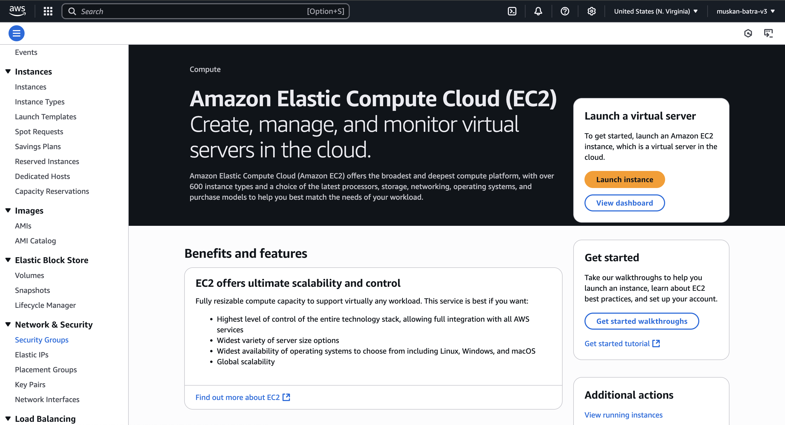
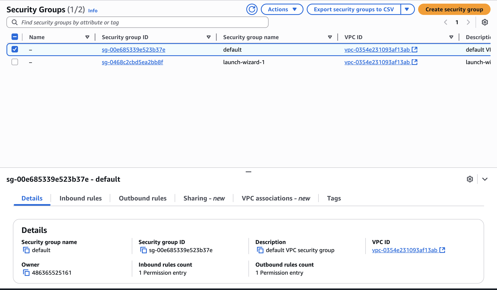
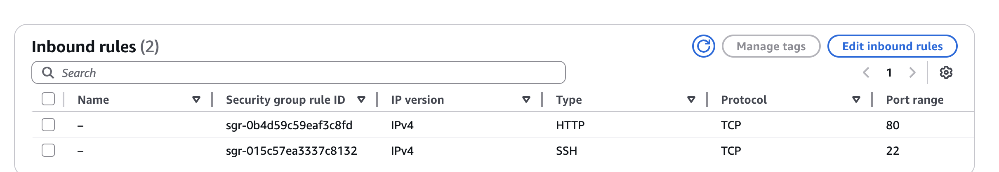
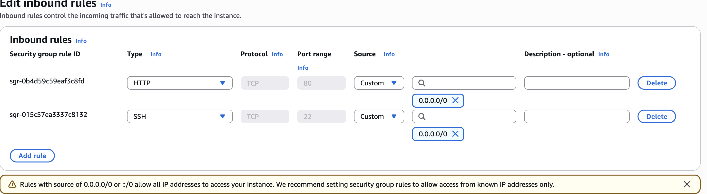

# SECURITY GROUPS HANDS ON

## we have launched our EC2 instance

## As you can see we have two security groups in our console so far default and launch wizard

## let click on the launch wizard instance

# Inbound Rules

## Inbound rules are rules that allow connectivity from the outside into the EC2 instance

## the accessing of the ip adress is possible due to the http at 80-port in the inbound rules

## anytime you see a timeout when you are trying to access an EC2 instance

# Outbound Rules
