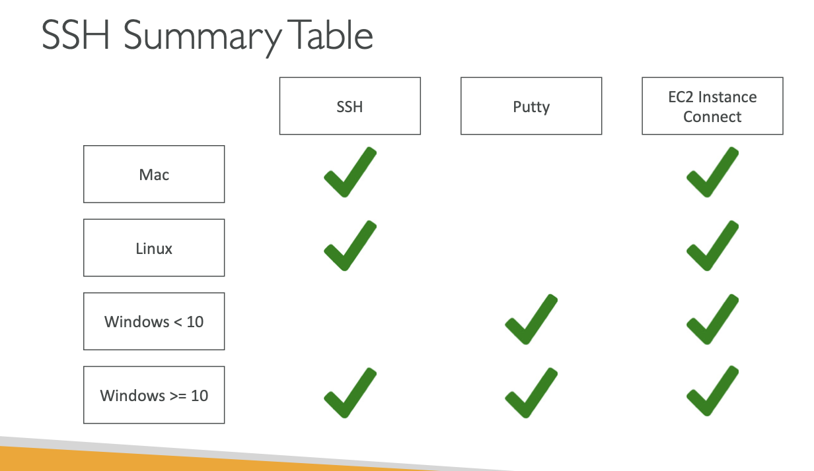

# SSH OVERVIEW

## Command line interface that can be used on MAC , LINUX and WINDOWS>=10

## Putty can be used on WINDOWS<10 AND WINDOWS>=10

## EC2 Instace Connect can be used on MAC , LINUX ,WINDOWS<10 AND WINDOWS>=10

`
