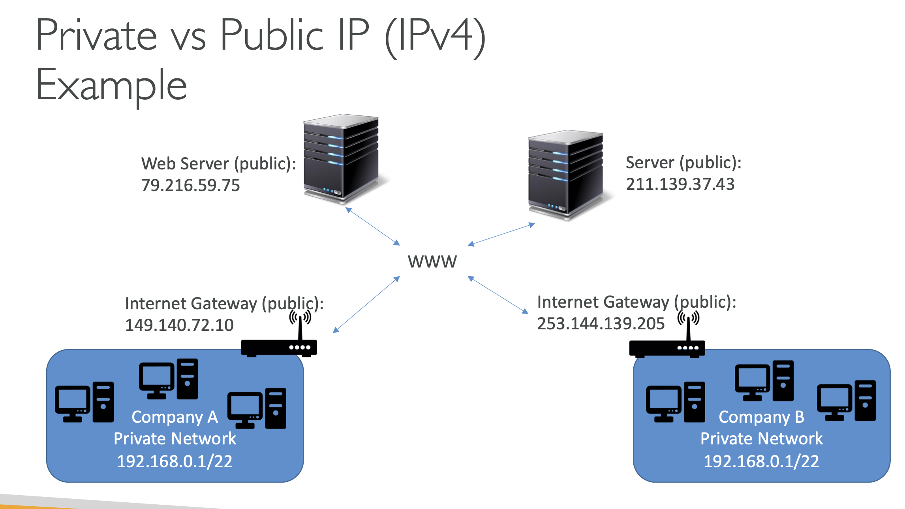
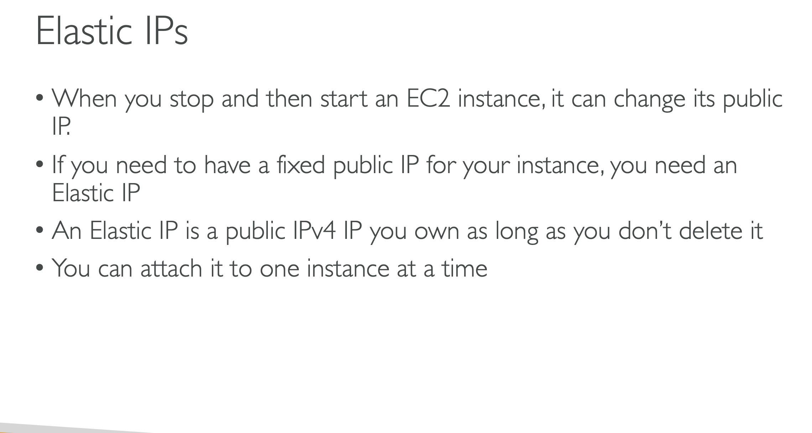
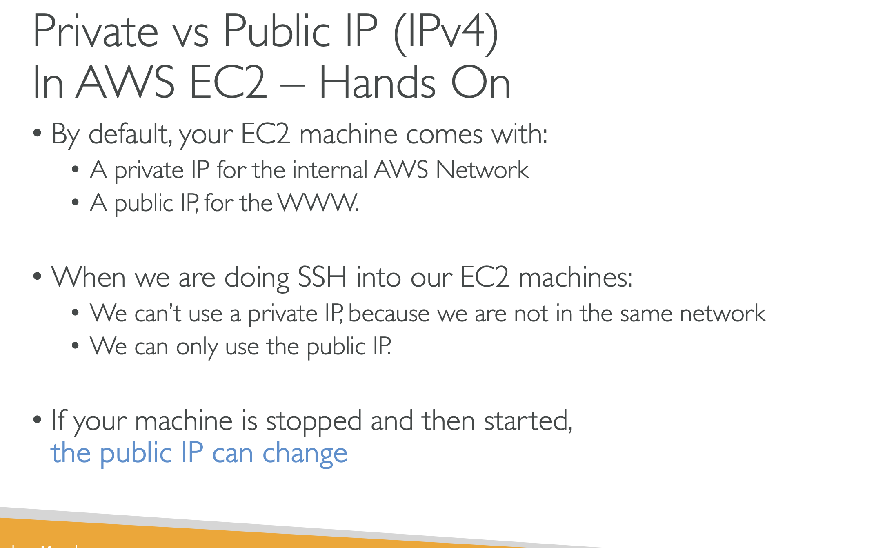

# PRIVATE VS PUBLIC VS ELASTIC IP

## Private vs Public IP (IPV4)

### Networking has two sorts of IPS IPV4 AND IPV6

### IPV4: 1.160.10.240

### IPV6:3ffe:1900:4545:3:200:f8ff:fe21:67cf

### In this course we will just be using IPV4

### IPV4 is the most common format used online

### IPV6 is newer and solves problem for the Internet of Things(IoT)

### IPV4 allows for 3.7 billion different addresses in the public spaces

## Private vs Public IP (IPV4)

## Now lets take an Example

### If you have a webserver that could be our EC2 instance or have a public IP , and we can have another public server with another public ip and using the public IP these servers can talk to one another , which is great

### Now when we have a company forExample: My Company and has a private network , the private network basically have this very specific way of being defined, means all the computers within that private network, can talk to one another using that private network, when you touch an internet gateway which is a public gateaway, well these instances will also get access to other servers and so that is a common pattern in AWS

## Public Ip

### Public Ip means that the machine can be identified on the internet(WWW)

### Must be unique across the whole web not two machines can have the same public (IPS)

### Can be geo located easily

## Private Ip

### Private Ip means the machine can only be identified on a private network only.

### The IP must be unique across the private network.

### BUT two different private networks(two companies ) can have the same IP'S

### Machine connect to WWW using a NAT + internet gateaway (a proxy)

### Only a specified range of IPS can be used as private IP

## Elastic Ips

### When you stop and start an EC2 instance it can change its public .

### If you need to have a fixed public IP for your instance , you need an Elastic Ip

### An elastic Ip is a public IPV4 IP you own as long as you dont need it

### You can attach it to one instance at a time

### With an Elastic IP address, you can mask the failiure of an instance or software by rapidly remapping the

### address to another instance in your account

### You can only have 5 Elastic IPS in your account(You can ask AWS to increase that)

## Overall , try to avoid using Elastic IP

### They often reflect poor architectural decissions

### Instead use a random publicIP and register a DNS name to it

### Or as we 'll see later use a load Balancer and dont use a public IP

## By default , your EC2 machine machine comes with:

### A private IP for the internal AWS network

### A public IP for the WWW

## When we are doing SSH into our EC2 machines

### We cant use a private IP , because we are not in the same network

### We can only use the public IP

### If your machine is stopped and then started , THE PUBLIC IP CAN CHANGE

