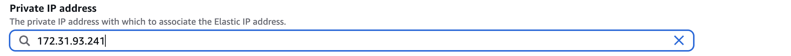
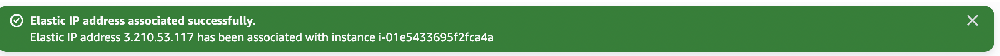
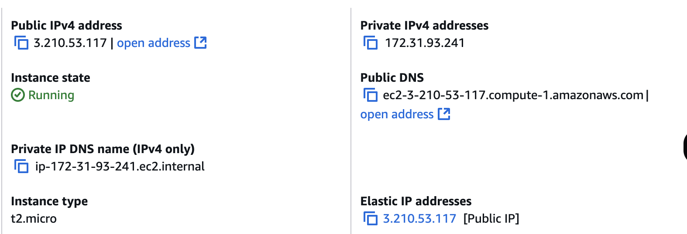
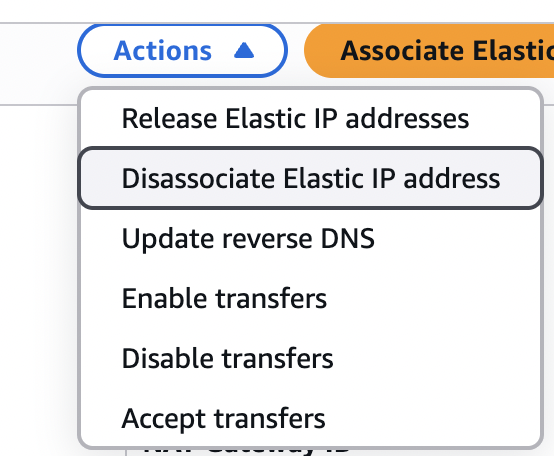

# PRIVATE VS PUBLIC VS ELASTIC IP HANDS ON

# Lets copy the Ipv4 instance address from here in the console

# Lets see the behavoiur of our instance when we start and stop it

# how do we solve this problem we might want to stop and start our instance but not change the Ip ,we use Elastic Ip

## firt click on Elastic Ip in the left

## Then on Allocate Ip adresses

# pricing of ipv4 adressess , its 0.05$ per hour so its important to remove the instance

# to remove the elastic ip we can disassociate it

