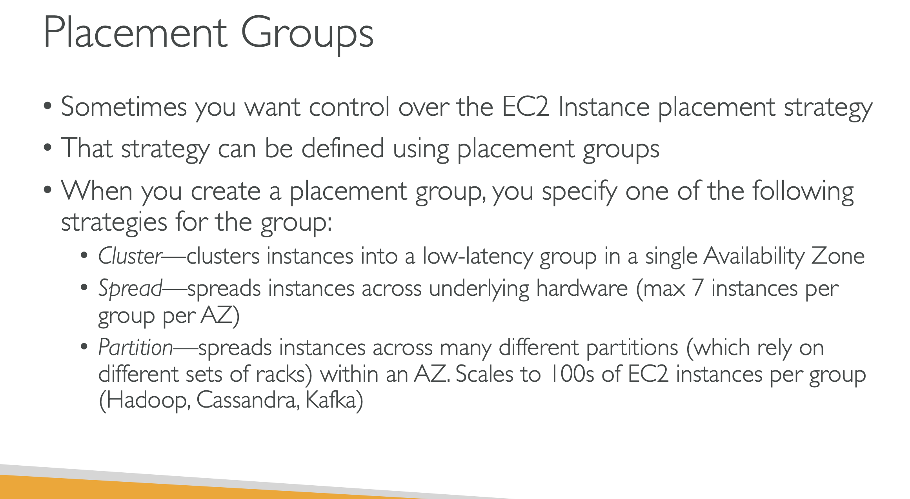

# EC2 PLACEMENTS GROUPS

# PLACEMENT GROUPS

## Sometimes you want to control over the EC2 instance placement stratergy

## The strategy can be defined using placement groups

## When you create a placement group, you specify one of the following startegies of the group:

### CLUSTER: Clusters instances into a low latency group in a single availibility zone

### SPREAD: Spread instances across underlying hardware(max 7 per instances per group per AZ)

### PARTITION: Spread instances across many different partitions(which rely on different sets of racks ) within an AZ. Scales to 100s EC2 instances per group(Hadoop, Casandra ,Kafka)

