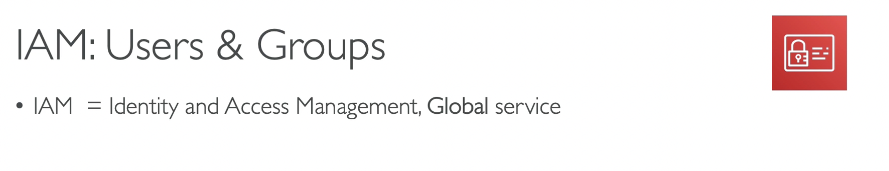
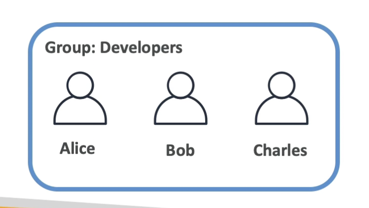
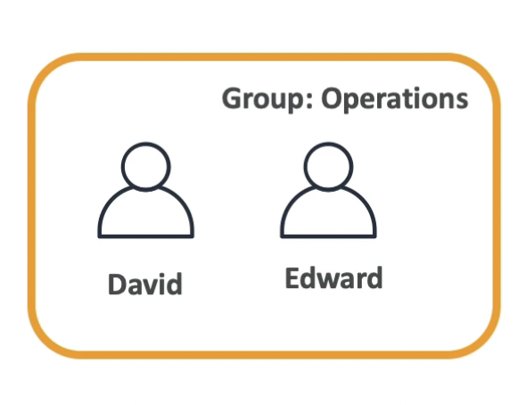
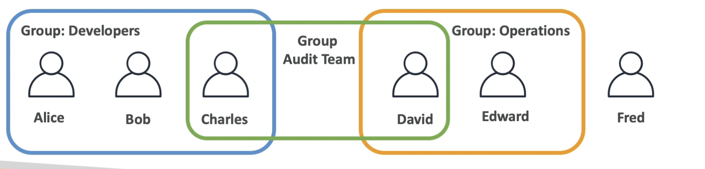
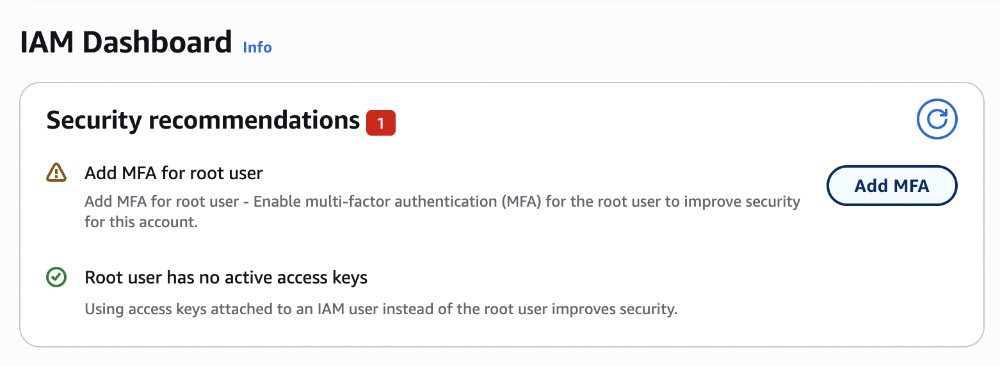

# EC2 PLACEMENTS GROUPS HANDS ON

# PRIVATE VS PUBLIC VS ELASTIC IP

## Private vs Public IP (IPV4)

### Networking has two sorts of IPS IPV4 AND IPV6

### IPV4: 1.160.10.240

### IPV6:3ffe:1900:4545:3:200:f8ff:fe21:67cf

### In this course we will just be using IPV4

### IPV4 is the most common format used online

### IPV6 is newer and solves problem for the Internet of Things(IoT)

### IPV4 allows for 3.7 billion different addresses in the public spaces

## Private vs Public IP (IPV4)

## Now lets take an Example

### If you have a webserver that could be our EC2 instance or have a public IP , and we can have another public server with another public ip and using the public IP these servers can talk to one another , which is great

### Now when we have a company forExample: My Company and has a private network , the private network basically have this very specific way of being defined, means all the computers within that private network, can talk to one another using that private network, when you touch an internet gateway which is a public gateaway, well these instances will also get access to other servers and so that is a common pattern in AWS

###

