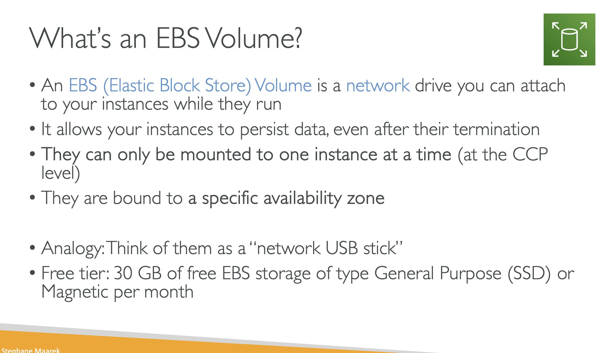

# EBS VOLUME

# WHAT IS AN EBS VOLUME?

## An EBS (Elastic Block Store) VOLUME is a NETWORK drive you can attatch to your instances while they run

## It allows your instances to persist data , even after their termination

## They can only be mounted to one instance at a time(at the CCP level)

## They are bound to a specific availibility zone

## Analogy : Think of them as a "network USB stick"

## Free teir: 30 GB of free EBS storage of type General Purpose(SSD) or Magnetic per month

# EBS VOLUME

## Its a network Drive(i:e Not A Physical Drive)
